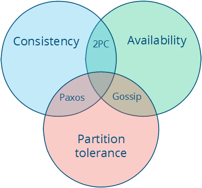

# Distributed System

https://www.youtube.com/playlist?list=PLrw6a1wE39_tb2fErI4-WkMbsvGQk9_UB

https://www.youtube.com/playlist?list=PLOE1GTZ5ouRPbpTnrZ3Wqjamfwn_Q5Y9A

https://book.mixu.net/distsys/single-page.html

- [Distributed System](#distributed-system)
  - [Vấn đề nền tảng](#vấn-đề-nền-tảng)
  - [Communication](#communication)
  - [Partitioning (Sharding) \& Replication](#partitioning-sharding--replication)
  - [Consistency Models](#consistency-models)
  - [Coordination](#coordination)
    - [Consensus: nhiều tiến trình/replica đồng ý một giá trị theo thứ tự (ghi log, chọn leader, commit transaction)](#consensus-nhiều-tiến-trìnhreplica-đồng-ý-một-giá-trị-theo-thứ-tự-ghi-log-chọn-leader-commit-transaction)
    - [Membership and Coordination Services](#membership-and-coordination-services)
    - [Distributed Transactions: Đảm bảo tính ACID trong hệ thống phân tán](#distributed-transactions-đảm-bảo-tính-acid-trong-hệ-thống-phân-tán)
    - [Timer and Clock Synchronization](#timer-and-clock-synchronization)
    - [Conflict](#conflict)
      - [Conflict Detection:](#conflict-detection)
      - [Conflict Prevention:](#conflict-prevention)
      - [Conflict Resolution](#conflict-resolution)
    - [Distributed Lock (Mutual Exclusion phân tán)](#distributed-lock-mutual-exclusion-phân-tán)
      - [**Bài toán thực tế**:](#bài-toán-thực-tế)
      - [Giải pháp:](#giải-pháp)
      - [**Vấn đề Expire Time (TTL) khi gặp Network Partition/Failure**:](#vấn-đề-expire-time-ttl-khi-gặp-network-partitionfailure)
      - [Vấn đề HA:](#vấn-đề-ha)
      - [Bài toán high-concurrency inventory deduction](#bài-toán-high-concurrency-inventory-deduction)
  - [Fault Tolerance \& Recovery: cách duy trì hoạt động ổn định, nhất quán dữ liệu và availability cao dù failures.](#fault-tolerance--recovery-cách-duy-trì-hoạt-động-ổn-định-nhất-quán-dữ-liệu-và-availability-cao-dù-failures)
    - [Fault Tolerance: tập trung vào việc tiếp tục chạy](#fault-tolerance-tập-trung-vào-việc-tiếp-tục-chạy)
    - [Recovery : việc sửa chữa và quay lại trạng thái đúng](#recovery--việc-sửa-chữa-và-quay-lại-trạng-thái-đúng)
  - [Durability \& Storage Layer](#durability--storage-layer)

## Vấn đề nền tảng 

* Distributed System sinh ra để giải quyết: scalability, fault tolerance, availability, latency (boss told you, fun, needed a server... :>>)

* CAP Theorem: 
    * Một hệ thống phân tán phải đối mặt với ba thuộc tính:
        * Consistency: tất cả các node nhìn thấy cùng một dữ liệu tại cùng một thời điểm.
        * Availability: hệ thống vẫn phản hồi cho mọi yêu cầu, ngay cả khi một số node bị lỗi.
        * Partition tolerance: hệ thống vẫn hoạt động ngay cả khi mạng bị phân vùng (mất kết nối giữa các node).
    * => chỉ có thể đạt được đồng thời 2 trong 3 thuộc tính này, không thể có cả 3 cùng lúc((Thực tế P (Partition tolerance) là bắt buộc với mọi hệ phân tán — network partition luôn xảy ra. Vì vậy lựa chọn thực sự chỉ là CP vs AP, không phải giữa cả ba. "CA system" trong thực tế chỉ tồn tại trên single node hoặc khi giả định mạng không bao giờ fail.))
    * Ba loại hệ thống theo CAP: 
        * CA: các hệ thống dùng 2PC trong cơ sở dữ liệu.
        * CP: các giao thức quorum theo đa số, nơi các phân vùng thiểu số không thể hoạt động (như Paxos), Spanner, Etcd → sacrifice availability để giữ strong consistency. 
        * AP: DynamoDB, Cassandra → eventual consistency, luôn trả về 

        

    * Strong consistency và High availability khi mạng bị phân vùng.
        * Nếu muốn strong consistency (mọi node luôn thấy cùng dữ liệu), ta phải từ chối một số yêu cầu khi mạng phân vùng → giảm availability.
        * Nếu muốn high availability (luôn phản hồi), ta phải chấp nhận dữ liệu có thể khác nhau giữa các node → giảm consistency.
        * Cách “lách” là:
            * Tăng giả định (giả sử không có phân vùng).
            * Hoặc giảm yêu cầu (chấp nhận consistency yếu hơn, ví dụ eventual consistency).
        * Như vậy, “consistency” không chỉ có nghĩa là strong consistency, mà có nhiều mức độ khác nhau.
    * Strong consistency và Performance
        * Strong consistency yêu cầu các node phải trao đổi và đồng thuận cho mỗi thao tác → độ trễ cao.
        * Nếu chấp nhận mô hình consistency yếu hơn (cho phép replica trễ hoặc khác nhau), ta có thể giảm độ trễ và tăng tốc độ phản hồi.
    * Nếu không muốn từ bỏ Availability => chấp nhận dữ liệu tạm thời khác nhau, rồi sau đó phải hòa giải (conflict resolution).


* Môi trường hệ thống: 
    * Failure model:=> fault tolerance 
        * Crash fault (node chết im): đơn giản, thường gặp: 
            * Network failure: 
                * TCP/IP: a pair of nodes can communicate, or not
                * Ssh: guards against corruption, interception, and impersonation
                * => Loss of connectivity + network not fast enough

            * Node failure:
                * Crash, Power outage, Hardware failure, Out of memory/disk full
                * Strategies: Checkpoint state and restart (High latency) + Replicate state and fail over (High cost)

        * Byzantine fault: node gửi dữ liệu sai lệch (blockchain quan tâm). 
    * Network : có thể chậm, mất gói, partition. 
    * Time model: 
        * Synchronous (đồng bộ tuyệt đối): không thực tế. 
        * Asynchronous: không có bound time → khó consensus. 
        * Partial synchronous: thực tế nhất. 
    * Thực tế: gói tin có thể delay 200ms, mất, hoặc đến không theo thứ tự 

* Mục tiêu của hê phân tán: 
    * Scalability (Khả năng mở rộng): hệ thống phải xử lý tốt khi quy mô tăng.
        * Size scalability: thêm node thì hiệu năng tăng tuyến tính.
        * Geographic scalability: dùng nhiều datacenter để giảm độ trễ.
        * Administrative scalability: thêm node không làm tăng chi phí quản trị quá nhiều.

    * Performance & Latency (Hiệu năng và độ trễ):
        * Hiệu năng = lượng công việc hữu ích / tài nguyên sử dụng.
        * Latency = độ trễ giữa hành động và tác động có thể quan sát.
        * Latency bị giới hạn bởi tốc độ ánh sáng và phần cứng.
  
    * Availability & Fault tolerance (Khả dụng và chịu lỗi):
        * Hệ thống phải tiếp tục hoạt động ngay cả khi một số thành phần hỏng.
        * Được đo bằng “số số 9” (ví dụ: 99.99% uptime ≈ <1 giờ downtime/năm).((Bảng đối chiếu: 99.9% ≈ 8.7h/năm; 99.99% ≈ 52 phút/năm; 99.999% ≈ 5 phút/năm. Mỗi “9” thêm vào đòi hỏi thiết kế phức tạp và chi phí hơn nhiều — thường không tuyến tính.))
        * Fault tolerance = định nghĩa trước loại lỗi và thiết kế hệ thống chịu được chúng.

## Communication
* Protocol: cách các node gửi/nhận messages, xây dựng trên network layers (TCP/IP stack), nhưng trong distributed systems, tập trung vào reliability, performance, và semantics 

    * TCP/UDP: TCP có overhead cao (connection setup), dễ bottleneck nếu nhiều connections. UDP phù hợp realtime (video streaming), nhưng cần app-level retry 

    * HTTP/REST, RPC (gRPC, Thrift): HTTP/REST đơn giản (stateless), nhưng ít efficient hơn gRPC (binary vs JSON), grpc hay dùng cho inter-service calls trong các microservice 

    * Message Queue (Kafka, NATS, RabbitMQ), Pub/Sub: Async messaging cho decoupling. Kafka dùng partitions (sharding) + replication (Raft-like) cho high throughput; RabbitMQ dùng exchanges/queues cho routing flexible 

    * ==> Vấn đề:  
        * Latency & Bandwidth: Network delay -> Compression (Protobuf), batching. 
        * Failures: Messages lost/duplicated/out-of-order -> Acks, sequence numbers (như offsets in Kafka), và retries với exponential backoff. 
        * Security: Encryption (TLS cho gRPC/HTTP), authentication (OAuth/JWT). Vấn đề: Man-in-middle attacks nếu không TLS. 
        * Scalability: Too many connections overload -> Connection pooling, message batching. 

* Load Balancing:  

    * Round-robin, least connections:  

    * Consistent hashing: Hash key/request để map đến node. Giảm remap khi nodes change 
        * Basic Hash Ring:  
            * Hash mỗi node thành một điểm trên vòng tròn 
            * Key được hash gán cho node gần nhất theo chiều kim đồng hồ  
            * ==> thêm node: key trong vùng thêm mới phải gán lại vào node, xoá cũng tương tự 
        * Virtual Nodes: Mỗi node có nhiều điểm trên vòng → cân bằng tải tốt hơn((Không có virtual nodes: thêm 1 node chỉ chia 1 vùng → load không đều. Với ~150 virtual nodes/node, khi thêm/xóa node nhiều vùng nhỏ cùng rebalance → phân phối đều hơn nhiều. Cassandra, DynamoDB dùng kỹ thuật này.))
    
    ...

* Service Discovery: DNS, ZooKeeper, etcd. 

* Reliability: retry, timeout, backoff. 
    * At-least-once → có thể duplicate. 
    * At-most-once → có thể mất. 
    * Exactly-once → cực khó (Kafka transaction, Spanner).((Kafka exactly-once: idempotent producer (dedup bằng sequence number) + transactional API (atomic write across partitions). Overhead ~5–15% throughput so với at-least-once. Spanner dùng 2PC + TrueTime để đảm bảo globally.))
* Figure: 
    * Ping cùng region AWS ~ 1–2 ms. 
    * Cross-region ~ 50–100 ms. 
    * Cross-ocean (VN → US) > 200 ms 

## Partitioning (Sharding) & Replication 

* Partitioning (Sharding): chia dữ liệu thành nhiều phần (shards/partitions), mỗi phần được lưu trữ và xử lý độc lập trên các node khác nhau.
    * Kỹ thuật:  
        * Hash: dễ scale, nhưng range query khó. 
        * Range: query theo range dễ, nhưng dễ skew (hotspot). 
        * Consistent hashing: chỉ ảnh hưởng ít node khi thêm/bớt server. 

* Replication: lưu nhiều bản sao của cùng một dữ liệu trên các node khác nhau, tăng availability, fault tolerance => chi phí ghi va consistency => xuất hiện nhiều thuật toán đồng thuận (Paxos, Raft) và mô hình consistency
    * Kỹ thuật: 
        * Leader-follower: dễ reasoning, latency thấp. 
        * Leaderless (Dynamo): ghi vào N node, đọc từ R node => Quorum: W + R > N → đảm bảo consistency((Tại sao W+R>N đảm bảo consistency? Vì write quorum và read quorum overlap ít nhất 1 node → node đó luôn có write mới nhất → read thấy. Ví dụ N=3, W=2, R=2: 2+2=4>3, overlap 1 node. Nếu W=1, R=1 thì 1+1=2 không > 3 → có thể đọc stale.))
        * Chain Replication. 
 
* Đây là nơi học về trade-off scale vs reliability, consistency và availability

## Consistency Models

* Các loại: 
    * Strong consistency: đọc luôn thấy dữ liệu mới nhất. 
    * Eventual consistency: sau một khoảng thời gian, các replica converge. 
    * Causal consistency: đảm bảo quan hệ nhân-quả. 
    * Read-your-writes: user đọc lại giá trị mình vừa viết. 

* Ex: 
    * DynamoDB có strong không? → Mặc định eventual, optional strong 
    * Google Spanner làm sao strong mà multi-region? → Dùng TrueTime API (GPS + Atomic clock) để bound uncertainty < 7 ms.((TrueTime trả về interval [earliest, latest] thay vì timestamp cố định. Spanner commit-wait: transaction phải chờ đúng khoảng uncertainty (~7ms) trước khi commit — đảm bảo mọi node ở mọi datacenter có timestamp sau commit. Đây là lý do write latency ~10–14ms.))

## Coordination
Là cách các node phối hợp hành vi (ai làm leader, ai ghi log, ai phản hồi client) 

### Consensus: nhiều tiến trình/replica đồng ý một giá trị theo thứ tự (ghi log, chọn leader, commit transaction)

* Thuộc tinh cơ bản:
    * Safety = Agreement + Validity + Integrity
        * Agreement: Tất cả các tiến trình đúng (không bị lỗi) phải đồng ý cùng một giá trị.
        * Validity: Giá trị được quyết định phải là một trong những giá trị đã được đề xuất bởi tiến trình.
        * Integrity: Mỗi tiến trình chỉ được quyết định một lần, không thể thay đổi quyết định sau khi đã chọn
    * Liveness = Termination: Mọi tiến trình đúng cuối cùng phải đi đến một quyết định.

* The FLP impossibility
    * Giả định của mô hình bất đồng bộ:
        * Các tiến trình chạy song song trên nhiều node độc lập.
        * Mạng truyền thông đáng tin cậy (không mất gói), nhưng độ trễ có thể vô hạn.
        * Node có thể hỏng theo kiểu crash (dừng hoạt động).
        * Không có đồng hồ chung, không có giới hạn thời gian.
    
    * Phát biểu: 
        * Không tồn tại thuật toán xác định nào giải quyết được bài toán đồng thuận trong hệ thống bất đồng bộ có thể xảy ra lỗi, ngay cả khi thông báo không bao giờ có thể bị mất + nhiều nhất một quá trình có thể bị lỗi và nó chỉ có thể lỗi khi crash
    
    * Lập luận:
        * Trong mạng bất đồng bộ không thể phân biệt “trễ” với “hỏng” => tiến trình cho phép trì hoãn vô hạn => có thể xây dựng một kịch bản thực thi mà thuật toán đó mãi ở trạng thái “bivalent” (chưa quyết định giá trị cuối cùng).
        * Do đó, termination (tất cả tiến trình cuối cùng phải ra quyết định) không thể đảm bảo.
    * Ý nghĩa: FLP cho thấy rằng trong mô hình bất đồng bộ thuần túy, đồng thuận là bất khả thi.
        * Nới lỏng giả định: ví dụ, giả định hệ thống partially synchronous (mạng có lúc trễ rất lâu, nhưng không phải lúc nào cũng vô hạn).
        * Chấp nhận trade-off: thuật toán có thể hy sinh safety (tính đúng đắn) hoặc liveness (khả năng tiến triển).
        * ==> các thuật toán như Paxos, Raft được thiết kế trong mô hình partial synchrony

* Paxos: được dùng để xây dựng các hệ thống replicated state machine (như cơ sở dữ liệu phân tán), đảm bảo tất cả nodes có trạng thái giống nhau ==> thống nhất 1 giá trị duy nhất, ngay khi có máy bị hỏng hoặc mạng bị chập chờn. 

    * Safety requirements: 
        * Choose in proposers. 
        * Choose only 1 value. 
        * No learn value (không lan truyền sai) trừ khi nó thực sự được chọn. 

    * Liveness:  
        * Nếu có người đề xuất → cuối cùng sẽ có value được chọn. 
        * Nếu đã chọn → mọi node sẽ biết value 
        * But có thể livelock: trạng thái khi có nhiều hoặc không ai làm leader((Livelock Paxos: hai proposer cạnh tranh liên tục, A prepare xong thì B prepare với ballot cao hơn làm A abort, A retry ballot cao hơn nữa... vòng lặp vô tận. Giải pháp: Multi-Paxos — bầu 1 distinguished leader duy nhất, chỉ leader đó propose trong steady state.))

    * Mô hình giả định:  
        * Asynchronous (tin nhắn chậm, lặp, mất nhưng không hỏng) 
        * non-Byzantine (nodes có thể crash/restart, nhưng không gian dối) 
        * stable storage để nhớ thông tin qua failure. 

    * Thành phần:  
        * Proposers: Đề xuất giá trị (như client gửi request). 
        * Acceptors: Quyết định chấp nhận (accept) đề xuất nào (thường là majority để chịu lỗi). 
        * Learners: Học giá trị đã chọn (như nodes áp dụng giá trị). 

* ZAB (ZooKeeper Atomic Broadcast):
    * Giao thức consensus tùy chỉnh dành riêng cho ZooKeeper (external coordinate service).
    * Thiết kế để giải quyết vấn đề cốt lõi của mọi hệ phân tán lớn: “Làm sao để hàng trăm/thousands node biết trạng thái của nhau, đồng bộ hành động, và tránh xung đột mà không bị lỗi, race condition, deadlock hay split-brain? - cung cấp một tập primitives, giữ các metadata nhỏ nhưng cực quan trọng: ai đang là leader, node nào đang sống, config hiện tại, lock/lease đang thuộc về ai.
    * ZooKeeper cung cấp primitives để coordination dựa trên:
        * Znode (giống file system tree): `/app/leader`, `/services/payments/instances/...`
        * Ephemeral node: tự biến mất khi client session chết (process crash, mất kết nối lâu)((Leader election dùng ephemeral node: process tạo `/election/leader` ephemeral. Nếu process chết, ZK tự xóa node → watcher của các process khác nhận notification → bầu lại. Không cần polling, không có zombie leader.))
        * Sequential node: ZooKeeper tự gắn số tăng dần để tạo hàng đợi/cạnh tranh công bằng hơn
        * Watch: cơ chế notify khi znode thay đổi (phù hợp service discovery/config)
* Raft:
    * Thiết kế với mục tiêu "dễ hiểu và dễ lập trình" thay cho sự phức tạp của Paxos. Tách biệt rõ 3 phần: Leader Election, Log Replication, và Safety.
    * Rất phổ biến hiện nay: nhúng vào etcd, Consul, hoặc Kafka (KRaft mode).
* **Xu hướng (External vs Internal Consensus)**:
    * Trái với trước đây khi các hệ thống dựa vào external coordinate service (như Kafka dùng ZooKeeper + ZAB) để bầu leader và lưu metadata (dễ có SPOF nếu cấu hình sai, failover chậm, khó vận hành 2 hệ thống song song).
    * Hiện tại các hệ thống hướng tới nhúng consensus trực tiếp vào trong (Kafka KRaft, MongoDB). Ví dụ Kafka KRaft dùng các broker làm quorum controller bằng Raft, metadata cất tại topic nội bộ `__cluster_metadata` -> failover nhanh (sub-second), loại bỏ rủi ro SPOF từ thành phần ngoài.


### Membership and Coordination Services
Các hệ thống như **ZooKeeper**, **etcd**, hoặc **Consul** thường được gọi là "distributed key-value stores" nhưng thực chất chúng sinh ra làm **coordination / configuration / membership services**.
* **Đặc điểm chung**:
    * Dữ liệu dung lượng nhỏ, được giữ hoàn toàn trên RAM. Không dùng để lưu trữ runtime app data lớn.
    * Dữ liệu được replicate nhất quán qua các node bằng thuật toán Total Order Broadcast (như Zab trong ZooKeeper, Raft trong etcd).
* **Tính năng hỗ trợ System Coordination (theo mô hình Google Chubby / ZooKeeper)**:
    * **Linearizable atomic operations**: Hỗ trợ Compare-And-Set nguyên tử, cung cấp nguyên liệu hoàn hảo để xây dựng Distributed Lock.
    * **Total ordering of operations**: Thay vì chỉ cấp lock trơn, chúng hỗ trợ **fencing token** (một dãy số luôn tăng mỗi lần lock được cấp). Số fencing token này sẽ được kẹp vào các request sau đó tới Storage để chặn write từ các zombie process (process bị lag rồi mới thức dậy).
    * **Failure detection**: Cung cấp hệ thống session (ephemeral nodes). Nếu một tiến trình giữ lock chết hoặc mất kết nối mạng, session timeout và lock sẽ tự động được thu hồi an toàn mà không phải chờ quá lâu.
    * **Change notifications**: Clients có thể tạo watchers theo dõi tài nguyên. Ngay khi có thay đổi (vd leader chết), watcher trả về thông báo thay vì client phải polling.
* **Ứng dụng thực tế và Xu hướng Coordinator**:
    * **Leader election / HA**: Giúp hệ thống tránh split-brain. Ví dụ PostgreSQL điển hình dùng Patroni kết nối tới **etcd** (Raft) làm coordinator bên ngoài bầu master.
    * *(Lưu ý: Không phải ai cũng dùng coordination ngoài. Redis tự bầu master bằng Sentinel theo quorum majority; MongoDB, ES có các thuật toán Raft-like election tích hợp bên trong).*
    * **Quản trị Metadata & Controller**: Lấy ví dụ Kafka trước bản 4.0 phụ thuộc mạnh vào ZooKeeper (External Coordination) để quản lý metadata, cluster health... Sau này chuyển sang KRaft (Internal) để giảm Overhead quản lý phức tạp và lỗi SPOF hệ thống phụ.
    * **Cluster Membership**: Theo dõi trạng thái node thông qua ephemeral nodes / heartbeat. Khoá sẽ tự giải phóng ngay khi session/node timeout.

### Distributed Transactions: Đảm bảo tính ACID trong hệ thống phân tán 
* 2PC:  
    * Cách hoạt động:  
        * Phase 1 (Prepare): Coordinator gửi "Prepare?" đến tất cả participants. Mỗi participant kiểm tra (lock resources, ghi log), nếu OK thì vote "Yes" (prepared), nếu không thì "No" (abort). 
        * Phase 2 (Commit): Nếu tất cả vote "Yes", coordinator gửi "Commit" để apply changes. Nếu bất kỳ "No", gửi "Abort" để rollback. 
        * Nếu participant fail giữa chừng, coordinator chờ timeout rồi abort. 
    * Ưu: Đảm bảo atomicity mạnh (all or nothing). 
    * Nhược:  
        * Blocking (participants lock resources chờ phase 2, chậm nếu coordinator fail).  
        * Không scale tốt với nhiều nodes (nếu một service bị treo → cả hệ thống chờ). 
        * Phụ thuộc vào coordinator 

* 3PC: thêm 1 pha trung gian giảm khả năng treo -> Khắc phục nhược điểm blocking 2PC 
    * Cách hoạt động:  
        * Phase 1 – CanCommit (Voting phase) 
            * Coordinator hỏi: “Có thể commit không?” 
            * Participants trả lời YES/NO. 

        * Phase 2 – PreCommit(Prepare-to-commit) 
            * Nếu tất cả trả lời YES, coordinator gửi PreCommit. 
            * Participants ghi log, chuẩn bị commit nhưng chưa thực hiện. 
            * Sau khi chuẩn bị xong, participants gửi ACK cho coordinator. 

        * Phase 3 – DoCommit (Final commit) 
            * Khi coordinator nhận đủ ACK, nó gửi DoCommit. 
            * Participants thực hiện commit chính thức. 
            * Nếu coordinator chết ở giai đoạn này, participants vẫn có thể dựa vào trạng thái log để tự quyết định (commit hoặc abort). 
    * Ưu:  
        * Non-blocking: giảm nguy cơ participants bị treo khi coordinator chết. 
        * Có thêm trạng thái trung gian (PreCommit) giúp các nút tự suy luận và tiếp tục tiến trình. 

    * Nhược:  
        * Phức tạp hơn: nhiều thông điệp hơn, tốn tài nguyên mạng. 
        * Vẫn chưa hoàn toàn loại bỏ được mọi tình huống lỗi (ví dụ lỗi mạng kéo dài). 

* Saga: xử lý long-lived transactions mà không lock lâu 
    * Cách hoạt động:  
        * Saga chia một giao dịch lớn thành chuỗi các local transactions, mỗi cái có action và compensating action (hủy bỏ nếu cần). 
        * Orchestration: 1central service điều khiển chuỗi: Thực hiện T1, nếu OK thì T2, ... Nếu fail ở Ti, thực hiện compensating cho T1 đến Ti-1. 
        * Choreography: Không central, mỗi service publish event (message queue như Kafka), service khác subscribe và xử lý/compensate. 
        * Không atomicity tuyệt đối, nhưng eventual consistency 
    * Ưu: Non-blocking, scale tốt, chịu lỗi cao (dùng message queues). 
    * Nhược:  
        * Phức tạp lập trình (cần design compensations, viết logic rollback thủ công)  
        * Không đảm bảo isolation tuyệt đối
* 2PC vs SAGA example:
    * Services: 
        * Order Service – tạo đơn hàng 
        * Inventory Service – trừ kho 
        * Payment Service – xử lý thanh toán 

    * 2PC:  
        * Prepare: 
            * Order Service gửi yêu cầu tạo đơn hàng → ghi tạm vào DB. 
            * Inventory Service trừ kho → ghi tạm vào DB. 
            * Payment Service xử lý thanh toán → ghi tạm vào DB. 
        * Commit: 
            * Nếu tất cả đều phản hồi OK, coordinator gửi lệnh commit → mọi service commit dữ liệu. 
            * Nếu một service lỗi, coordinator gửi lệnh rollback → mọi service hủy thao tác. 
    * Saga: 
        * Order Service tạo đơn hàng → commit ngay. 
        * Gửi event “Đơn hàng mới” → Inventory Service nhận và trừ kho → commit. 
        * Gửi event “Kho đã trừ” → Payment Service xử lý thanh toán → commit. 
        * Nếu bước nào lỗi, sẽ gọi compensating action  

### Timer and Clock Synchronization

Thời gian có tiến triển giống nhau ở mọi nơi không? 

* Global clock: Giả định mọi node có đồng hồ chính xác tuyệt đối, không lệch => cho phép xác định total order toàn hệ thống. Nhưng thực tế khó đạt: đồng hồ lệch, NTP không hoàn hảo, thậm chí người dùng đổi giờ máy. Ví dụ: Cassandra dùng timestamp để giải quyết xung đột (newer timestamp thắng). Nếu đồng hồ lệch → dữ liệu mới có thể bị ghi đè bởi dữ liệu cũ. Google Spanner dùng TrueTime API để ước lượng sai số đồng hồ.

* Local clock: Mỗi máy có đồng hồ riêng => chỉ sắp xếp sự kiện trên cùng 1 máy, không so sánh được giữa các máy.

* No clock: Dùng logical time: Lamport clock hoặc vector clock. Không dựa vào đồng hồ vật lý, mà dựa vào quan hệ nhân quả (causality) cho phép xác định sự kiện nào xảy ra trước/sau/dồng thời, nhưng không đo được khoảng thời gian. Ví dụ: Riak, Voldemort dùng vector clock để tránh vấn đề lệch đồng hồ.
    * Lamport clocks: dùng số tăng dần để track thứ tự causality 
        * Mỗi node có counter, mỗi event counter +=1 
        * Gửi message: Gửi kèm counter. 
        * Nhận message: Counter = max(own counter, received) +1. 
        * A happens-before B nếu timestamp A < B và có causality((Giới hạn của Lamport: nếu timestamp(A) < timestamp(B) không có nghĩa A → B — có thể là concurrent. Lamport chỉ đảm bảo chiều thuận: A→B thì ts(A)<ts(B). Đây là lý do Vector Clock ra đời để phát hiện cả concurrent events.))

    * Vector Clocks: dùng vector (mảng) để track causality chi tiết hơn 
        * Mỗi node có vector kích thước N (nodes), vị trí i là counter của node i. mỗi event Vector[own_id] +=1 
        * Gửi: Gửi vector. 
        * Nhận: Vector[i] = max(own[i], received[i]) cho mọi i, rồi own_id +=1. 
        * So sánh: A happens-before B nếu mọi Vector_A[i] <= Vector_B[i] và ít nhất một < , Concurrent = không A before B + B before A((Ví dụ: VC_A=[2,1,0], VC_B=[1,2,0] → không A≤B (vì A[0]=2>B[0]=1) và không B≤A → concurrent. DynamoDB dùng vector clock để detect concurrent writes rồi trả về conflict cho application tự resolve.))

* Physical Clocks:  

....

### Conflict
Phổ biến do replication (để availability cao) và concurrency, đặc biệt dưới eventual consistency 

* Nguyên nhân: Network latency (trễ mạng) hoặc multi-master replication (nhiều nodes đều write).  
* Step: Detect → Merge/Reject → Converge 

#### Conflict Detection: 

* Versioning:  
    * Gắn version cho mỗi bản ghi, thao tác -> 2 bản ghi version khác nhau → có thể xung đột 
    * Dùng trong Optimistic Concurrency Control, Vector Clock, CRDTs 

* Timestamp: 
    * hai bản ghi cùng key nhưng timestamp khác → có thể là xung đột. 
    * Dùng trong Last-Write-Wins 

* Vector Clocks:  
    * Lamport/vector clocks detect causality, 2 updates concurrent (không before nhau) => conflict 
    * EX: DynamoDB, Cassandra phát hiện conflict các replica. 

* Operation Context: 
    * So sánh ngữ cảnh thao tác: ai ghi, ghi từ đâu, ghi lên gì. 
    * Dùng trong Operational Transformation (OT) và CRDTs 
    * EX: sửa đoạn văn bản 

* Checksum / Hash Comparison: 
    * hash của dữ liệu giữa các replica 
    * EX: Merkle Tree, Anti-Entropy Protocols 
    * Application-Level Rules 

#### Conflict Prevention: 

* Optimistic:  
    * Giả định ít conflict => write rồi check sau (dùng version/timestamp).  
    * Conflict => rollback hoặc merge => nhanh nhưng rủi ro nếu nhiều write. 
* Pessimistic: 
    * Lock data trước write (như 2PC), tránh conflict từ đầu => An toàn nhưng chậm, blocking (dễ deadlock) 

#### Conflict Resolution 

* Last-Write-Wins:  
    * Giữ lại giá trị có timestamp mới nhất:  
    * EX: DynamoDB (AWS) dùng LWW cho key-value store, Redis, Cassandra 
    * Đơn giản nhưng mất dữ liệu nếu hai giá trị đều hợp lệ nhưng bị ghi đè, mất lịch sử. 

* Version Vectors: 
    * Dùng Vectors detect causual nếu concurrent → Resolve bằng LWW hoặc custom 
    * EX: Distributed file systems (Dropbox), NoSQL DBs (Riak, CouchDB). 
    * Ưu điểm: Detect concurrency chính xác, hỗ trợ eventual consistency, kết hợp tốt với CRDTs/LWW . 
    * Nhược điểm: Vector lớn nếu nhiều nodes (overhead storage), không tự resolve (cần kết hợp LWW hoặc manual). 

* Operational Transformation: 
    * Dùng trong text/documents, collaborative editing bằng cách transform 
    * Cách hoạt động: Mỗi op (insert/delete) gắn context (position). Khi concurrent, transform op dựa op khác (ví dụ: A insert at pos 5, B delete at pos 3 → Adjust pos của A thành 4). OT (Central server hoặc peer-to-peer) merge = logic.  
        * Ví dụ: User A insert "x" at pos 0 ("abc" → "xabc"), User B insert "y" at pos 0 ("abc" → "yabc") → OT transform merge thành "xyabc" hoặc "yxabc" tùy logic. 
    * EXP: Google Docs dùng OT để merge realtime edits((Google Docs dùng OT qua server-authoritative model: mọi op đi qua 1 server trung tâm, server transform rồi broadcast. Peer-to-peer OT phức tạp hơn rất nhiều và dễ có edge case. Notion và một số tool mới chuyển sang CRDT để dễ implement hơn.))
    * Ưu điểm: Realtime, giữ intent của users (không mất op), tốt cho text-based collab. 
    * Nhược điểm: Phức tạp implement (transform logic khó), cần causal order (dùng Lamport clocks), không scale tốt cho non-text. 

* Quorum-Based Resolution: 
    * Cách hoạt động: Write yêu cầu W nodes confirm, read từ R nodes. Conflict: So sánh versions từ quorum, chọn majority hoặc latest. Kết hợp version vectors để detect.  
        * Ví dụ: Với N=3, W=2, R=2: Write succeed nếu 2/3 nodes OK. Read lấy majority value. 
    * EXP: Cassandra hoặc Dynamo dùng quorum cho consistency tunable: Trong hệ thống ngân hàng, quorum resolve balance conflicts bằng majority vote, đảm bảo safety 
    * Ưu điểm: Tunable consistency (strong nếu R+W>N), chịu lỗi tốt. 
    * Nhược điểm: Latency cao (chờ quorum) Chậm hơn CRDTs, không tự merge phức tạp (cần thêm LWW). 

* MVCC:  

...

* Tombstones:  
    * Marker "deleted" để resolve delete conflicts (không xóa hẳn, tránh resurrect).  
        * Ví dụ: Cassandra dùng tombstones trong replication, merge bằng propagate delete, distributed caches 
    * Ưu: Xử lý delete an toàn.  
    * Nhược: Tốn space đến compaction. 
 

* CRDTs (Conflict-Free Replicated Data Types): DS&Algo để merge => tốt cho AP 
    * Nguyên Lý Cốt Lõi 
        * Local Updates: Mỗi node update local state với operation như add, remove, increment. 
        * Propagation: Operations (hoặc state) được gửi đến các node khác qua mạng (asynchronous, như gossip protocol).((Gossip protocol: mỗi node định kỳ chọn ngẫu nhiên K nodes và trao đổi state. Convergence trong O(log N) rounds. Không có SPOF, tự chịu lỗi, dùng trong Cassandra, Riak cho membership + CRDT propagation.))
        * Merge Function: Khi nhận updates, node áp dụng hàm merge (commutative, associative, idempotent) để hợp nhất, không phụ thuộc thứ tự. 
    * Dùng khi: cộng tác văn bản (Docs/Notion), reactions/like, presence, danh sách, counters, graph 
    * Ưu:  
        * Tự động merge không cần coordination, non-blocking, scale tốt (hàng triệu nodes). 
        * Hỗ trợ offline updates (merge sau khi reconnect), lý tưởng cho eventual consistency. 
        * Chịu partition tốt (AP trong CAP). 
    * Nhược:  
        * Chỉ eventual consistency, không phù hợp strong consistency (như giao dịch ngân hàng). 
        * Overhead storage (state-based CRDTs lưu full state, tombstones tốn space). 
        * Phức tạp thiết kế cho dữ liệu phức tạp (như graphs). 

    * Các loại : 
        * CmRDT (Operation-Based):  
            * Gửi operations (như "add x to set") đến các node khác. 
            * Reliable (TCP hoặc retry) để đảm bảo op không mất. 
            * Merge bằng cách apply ops theo causal order (dùng vector clocks). 
            * Ví dụ: G-Counter (Grow-Only Counter) – chỉ increment, merge bằng sum. 
        * CvRDT (State-Based):  
            * Gửi toàn bộ state (hoặc delta state) thay vì ops. 
            * Merge bằng hàm merge lấy union hoặc max của states. 
            * Không cần reliable delivery (idempotent), nhưng tốn bandwidth hơn. 
            * Ví dụ: PN-Counter (Positive-Negative Counter) – track increments/decrements riêng, merge bằng max. 

* EXP: 

    * E-commerce (Shopee): CRDTs (OR-Set cho giỏ hàng) hoặc LWW (DynamoDB) tốt vì ưu tiên low latency, eventual consistency. Trade-off: Có thể mất update nếu clocks lệch, không dùng cho thanh toán (cần Quorum + 2PC). 

    * Banking (Vietcombank): Quorum-Based hoặc MVCC (PostgreSQL) cho strong consistency, tránh mất tiền. Trade-off: Latency cao, không scale tốt như CRDTs. 

    * Collaborative Editing (Google Docs): OT hoặc CRDTs lý tưởng cho realtime, merge edits mượt. Trade-off: Phức tạp code, không phù hợp counters. 

    * Social Media (TikTok): CRDTs (PN-Counter) cho likes/dislikes, merge tự động, chịu partition. Trade-off: Eventual, có thể tạm stale. 

    * IoT (Smart Home): CRDTs cho sensors (offline updates, merge sau). Trade-off: Storage overhead, không dùng cho critical control (cần Raft). 

    * Version Control (Git): Version Vectors + Application-Defined Logic để manual merge. Trade-off: Không tự động, chậm nhưng linh hoạt 

### Distributed Lock (Mutual Exclusion phân tán)
Trong môi trường phân tán, đôi khi ta cần đảm bảo tại một thời điểm chỉ có một node được phép thao tác lên một tài nguyên chung (shared resource) để tránh data corruption.
#### **Bài toán thực tế**:

* **Thanh toán / Trừ tiền (Double-spending prevention)**: Khi một user bấm "Thanh toán" hai lần liên tiếp (do mạng lag hoặc botspam). Distributed Lock đóng vai trò cửa gác, đảm bảo logic trừ tiền giao dịch chỉ thực hiện một lần duy nhất.
* **Cron Job phân tán**: Một hệ thống gồm 3 servers đồng thời chạy job. Để tránh trùng lặp, các servers bắt buộc phải xin xin Lock theo task ID trước khi chạy job. Server đầu tiên lấy được lock sẽ được quyền gửi, 2 server đến sau sẽ drop tác vụ.
* **Flash Sale (E-commerce)**: Chặn tình trạng bán vượt số lượng thực tế (overselling) khi hàng ngàn users cùng kết nối mua 1 món đồ hiện tại chỉ còn duy nhất 1 item trong kho.

#### Giải pháp: 
- Chubby (Google, 2006): Dựa trên Paxos, cung cấp coarse-grained lock + small file storage. Dùng lease + session để tự động release khi node chết.
- ZooKeeper / etcd: Phổ biến nhất hiện nay. ZooKeeper: Dùng ephemeral sequential node + watch. Protocol ZAB (gần Paxos). etcd: Dùng Raft (dễ hiểu & implement hơn Paxos).
- Fencing token – Mỗi lock trả về version number (zxid hoặc revision). Client phải gửi token này khi viết data; server reject nếu token cũ → tránh “split-brain” khi lock bị stale.
- Redlock (Redis): Nhanh nhưng không an toàn hoàn toàn trong partition (Kleppmann khuyên chỉ dùng khi chấp nhận rủi ro nhỏ).((Martin Kleppmann viết bài "How to do distributed locking" phân tích lỗ hổng Redlock khi gặp GC pause + clock drift. antirez (tác giả Redis) phản bác. Debate này là tài liệu kinh điển về trade-off distributed systems — đọc cả hai bên trước khi quyết định dùng Redlock.))
* **Cách hoạt động cơ bản (ví dụ bằng Redis)**:
    * Lấy lock: Dùng lệnh `SET resource_name my_random_token NX PX 30000` (`NX`: chỉ set nếu key chưa tồn tại, `PX 30000`: Time-to-Live = 30s để tránh deadlock nếu node giữ lock sập).
    * Nhả lock (lease): Client phải dùng Lua script kiểm tra xem value của key có khớp với `my_random_token` của mình không, nếu có thì mới `DEL`. Việc này đảm bảo tính atomicity và tránh nhả nhầm khóa của tiến trình khác khi khóa của tiến trình hiện tại bị timeout.
    * Lock Duration: Đảm bảo khóa không bị giải phóng quá sớm, giải quyết vấn đề Clock Drift trong distributed server khi mà task bị lock chạy quá nhanh 
* Thực tế: Hầu hết hệ thống lớn (kể cả Shopee, Tiki, Alibaba) dùng Redis Cluster + Lua script atomic cho flash sale/inventory thay vì Redlock, vì latency thấp và đủ tốt khi kết hợp sharding + reservation. Redlock chỉ dùng khi correctness cực kỳ quan trọng (ví dụ: financial transaction, unique code generation) và bạn chấp nhận tradeoff latency + vận hành phức tạp hơn.
#### **Vấn đề Expire Time (TTL) khi gặp Network Partition/Failure**:
  * Thiết lập TTL (Time-To-Live) là quy tắc bắt buộc để ngăn chặn Deadlock nếu Client đang giữ khóa bị đột tử (Crash). Tuy nhiên, khi kết hợp với môi trường phân tán nó phát sinh rủi ro rất lớn.
  * Giả sử Client 1 đang giữ khóa nhưng tiến trình kẹt quá lâu (do I/O chậm, Network Routing chậm lại, hoặc thường xuyên do tiến trình bị treo cứng do *Garbage Collection Pause*), khóa của Client 1 **tự động hết hạn (Expire)** trên Redis dù quá trình thao tác thay đổi ở nền tảng bên dưới vẫn chưa chạy xong.
  * Lúc này Client 2 thuận lợi chiếm được cùng mã khóa đó và thực hiện sửa đổi dữ liệu. Đột nhiên Client 1 hồi tỉnh sau khi GC kết thúc và chèn thao tác đè lên thao tác của Client 2 (Split-brain / Race Condition).
  * **Cách khắc phục**:
      * **1. Fencing Token (Đề xuất bởi Martin Kleppmann)**: Lock Server (ưu tiên ZK/etcd) cấp kèm một số đếm phiên bản luôn tăng (vd: 31). Storage layer (như Database) sẽ luôn kiên quyết từ chối lưu thay đổi nếu Client nộp mã số fencing cũ hơn giá trị hiện tại ở hệ thống (ví dụ Client 1 nộp token 30 nhưng DB đã có token 31 của Client 2) => Yêu cầu bắt buộc là Storage phải hiểu được Token Logic này.((Hạn chế của fencing token: storage phải được sửa để check token — không thể áp dụng cho hệ thống third-party (S3, external DB không hỗ trợ). Trong thực tế, nhiều hệ thống dùng application-level idempotency key (request_id) thay thế vì dễ implement hơn.))
      * **2. Lock Extension Runtime (Cơ chế Watchdog)**: Chạy một Background Thread chạy song song ngay tại tiến trình của Client (Ví dụ phổ biến điển hình: Watchdog trong **Redisson**).((Redisson là Java client cho Redis, implement Watchdog tự động. Khi JVM crash, Watchdog thread cũng chết theo → lệnh `pexpire` không được gửi → lock tự expire sau TTL. Nếu chỉ dùng `tryLock(timeout)` mà không có Watchdog, phải đặt TTL đủ lớn để bao phủ worst-case execution time.)) Giả sử khóa TTL là 30s, cứ mỗi 10s luồng Watchdog này sẽ liên lạc ngược về Redis để xin tự động nới rộng TTL về lại 30s chừng nào logic chính trên ứng dụng chưa kết thúc. Ngược lại nếu ứng dụng sập, Watchdog cũng chết theo, lệnh gia hạn biến mất và khóa sẽ tự expire an toàn chống Deadlock mà không sợ tranh chấp hết hạn giữa chừng.
#### Vấn đề HA: 
  * Nếu máy Redis đó sập, toàn bộ hệ thống Lock lỗi
  * Nếu dùng cơ chế Master-Slave replication như Sentinel/Cluster để HA => hổng về tính nhất quán (lúc failover dễ bị mất lock hoặc duplicate): 
    * Client A lấy Lock ở Master.
    * Master sập trước khi kịp đồng bộ sang Slave
    * Slave lên làm Master mới, nhưng chưa biết Client A đang giữ Lock.
    * Client B nhảy vào lấy Lock cùng tên thành công.

  * **Thuật toán Redlock**: Dành riêng cho phân phối khóa phân tán tránh SPOF, thiết kế để xử lý bài toán này trên một cụm gồm nhiều máy Redis độc lập (thường là 5) mà không cần đồng bộ giữa chúng.
      * Triển khai N node Redis master hoàn toàn độc lập (ví dụ N=5).
      * Client tự thực thi logic *consensus quorum*: xin khóa song song trên các nodes. Khóa hợp lệ nếu nhận phản hồi OK trên đa số (>= 3 nodes) và tổng thời gian phản hồi < TTL.
      * Đánh giá: Chịu được rủi ro thiểu số node chết, nhưng client tự coordinate nên chi phí mạng cao, và dễ bị rủi ro vì lệch giờ clock drift giữa các node.
      * Thông thường ưu tiên các giải pháp "nhẹ nhàng" hơn : 
        * Optimistic Locking: Dùng một cột version:  UPDATE account SET balance = 100, version = 6 WHERE id = 1 AND version = 5.
        * Thêm Unique Key là request_id, request chậm hơn sẽ bị lỗi Duplicate Key và bỏ qua.
      * Khi yêu cầu độ chính xác tuyệt đối, cần Distributed Lock thực thụ (Zookeeper hoặc Etcd- có Consensus an toàn) vì Redlock dựa Time-based, mà thời gian trong hệ thống phân tán là thứ không đáng tin

#### Bài toán high-concurrency inventory deduction
Mục tiêu: Không oversell/undersell, latency thấp (< 10ms/request), scale được đến hàng triệu request/giây

```sql
SELECT stock FROM product WHERE id = 1;  -- stock = 10
IF stock >= 1 THEN
    UPDATE product SET stock = stock - 1 WHERE id = 1;
    INSERT INTO order ...;
END IF;
```
Race condition -> Database lock → throughput thấp, DB overload → timeout, crash, microservices không đồng bộ => cần đảm bảo Atomicity, Fairness, Consistency

1 sô giải pháp tự nhiên : 
- Lock ở DB
```sql
// Pessimistic lock
SELECT * FROM orders WHERE id = 123 FOR UPDATE; 
UPDATE orders SET status = 'processing' WHERE id = 123;
// Optimistic Locking bằng cách thêm cột version, check + update cùng lúc
UPDATE orders
SET status = 'processing', version = version + 1
WHERE id = 123 AND version = 1; 
```
- Atomic Update
```sql
UPDATE orders
SET status = 'processing'
WHERE id = 123 AND status = 'pending';
```
- Với Flash sale có thể dùng Atomic Counter trên redis / Lua Script sau đó sharding để tăng tải

Chi tiết giải pháp:
- Pre-warm inventory vào Redis (trước sale 5-10 phút): Load stock = 10 vào Redis (có thể sharding thành 5 key × 2 cái để scale).
- Lua Script atomic
- Reserve-first, Confirm-later: Trừ stock Redis ngay → trả reservationID cho user, User thanh toán → confirm async qua queue → sync về DB.
- Layer bảo vệ thêm: Rate limiting (Token Bucket) per product/user, Circuit breaker + fallback

## Fault Tolerance & Recovery: cách duy trì hoạt động ổn định, nhất quán dữ liệu và availability cao dù failures. 

### Fault Tolerance: tập trung vào việc tiếp tục chạy 

* Cách hoạt động:  
    * Detection (Phát hiện): Giám sát liên tục qua heartbeat hoặc timeout 
    * Diagnosis (Chẩn đoán): Xác định loại lỗi: crash, Byzantine (node gian dối), omission (mất tin nhắn) hoặc network partition (mạng chia cắt). Dùng log analysis hoặc tracing tools 
    * Isolation/Containment: Ngăn lỗi lan bằng cách loại node lỗi khỏi cluster (circuit breaker pattern trong microservices) hoặc failover (chuyển traffic sang node lành). 
    * Mitigation/Recovery (Giảm thiểu/Khôi phục): Áp dụng redundancy để tiếp tục, rồi repair (restart node hoặc thay thế). 

* Kỹ thuật chính: 
    * Redundancy (Dư thừa): Replication dữ liệu/state qua nhiều nodes (active-active hoặc active-passive). Ví dụ: Raft/Paxos replicate log để chịu f failures trong 2f+1 nodes.((Công thức 2f+1: cần majority = f+1 votes để commit. Chịu 1 node fail cần 3 nodes; chịu 2 fail cần 5 nodes. etcd production thường dùng 3 (chịu 1 fail) hoặc 5 (chịu 2 fail). 7 nodes trở lên ít dùng vì latency tăng mà lợi ích fault tolerance nhỏ.))
    * Failover và Load Balancing: Tự động chuyển sang standby nếu primary fail (như AWS ELB detect và reroute traffic). Kết hợp auto-scaling để thêm nodes khi tải cao. 
    * Graceful Degradation: Giảm chức năng tạm thời (ví dụ: Netflix chuyển sang cache-only mode nếu database fail, vẫn cho xem phim nhưng không update profile). 

### Recovery : việc sửa chữa và quay lại trạng thái đúng 

* Cách hoạt động:  
    * Backward Recovery: rollback state trước lỗi dùng log/checkpoint để undo changes. 
    * Forward Recovery: Tiếp tục từ lỗi bằng cách redo từ redundancy, không cần quay lại. 

* Kỹ thuật chính:  
    * Checkpointing:  
        * Lưu snapshot state định kỳ vào stable storage (disk hoặc cloud).  
        * Khi fail, load checkpoint và replay log từ đó 

    * Logging:  
        * Ghi mọi operation vào log trước apply (Write-Ahead Logging - WAL).  
        * Types: Physical (byte-level changes), Logical (high-level ops như "update user=1"), Physiological (kết hợp).  
        * Sau fail, replay log để recover. 

    * Shadow Paging:  
        * Tạo copy pages khi write, chỉ switch khi commit (như Git branching) 
        * Nhanh nhưng tốn space. 

    * Quorum-Based Recovery:  
        * Dùng majority vote từ replicated nodes để quyết định state đúng (như Raft recover leader từ log followers). 

    * ARIES (Algorithm for Recovery and Isolation Exploiting Semantics): Kỹ thuật recovery tiên tiến cho database, dựa WAL, hỗ trợ fine-granularity locking và partial rollback. ARIES chia 3 phases:  
        * Analysis: Scan log từ checkpoint cuối cùng để xác định transactions active/dirty pages tại crash, xây Dirty Page  Table và Transaction Table. 
        * Redo: Lặp lại (redo) tất cả operations từ checkpoint để đưa database về state tại crash (forward recovery), dùng LSN (Log Sequence Number) để tránh redo thừa.((LSN là số tăng dần duy nhất. Mỗi page lưu pageLSN = LSN của log record cuối đã apply lên page. Khi redo: nếu logRecord.LSN <= page.pageLSN → page đã có thay đổi đó, skip. Tránh redo thừa khi page đã được flush ra disk trước crash.))
        * Undo: Quay lại (undo) transactions unfinished bằng cách rollback từ end-of-log ngược lại. ARIES dùng Compensation Log Records (CLRs) để track undo mà không redo undo, hỗ trợ nested transactions và independent page recovery. 

## Durability & Storage Layer 

...