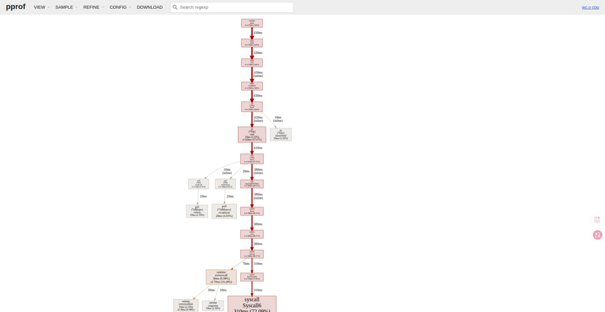
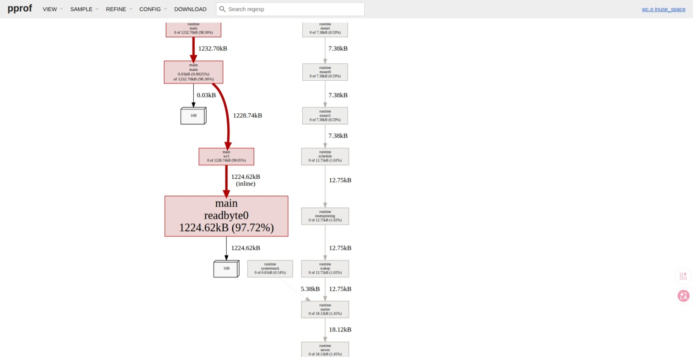
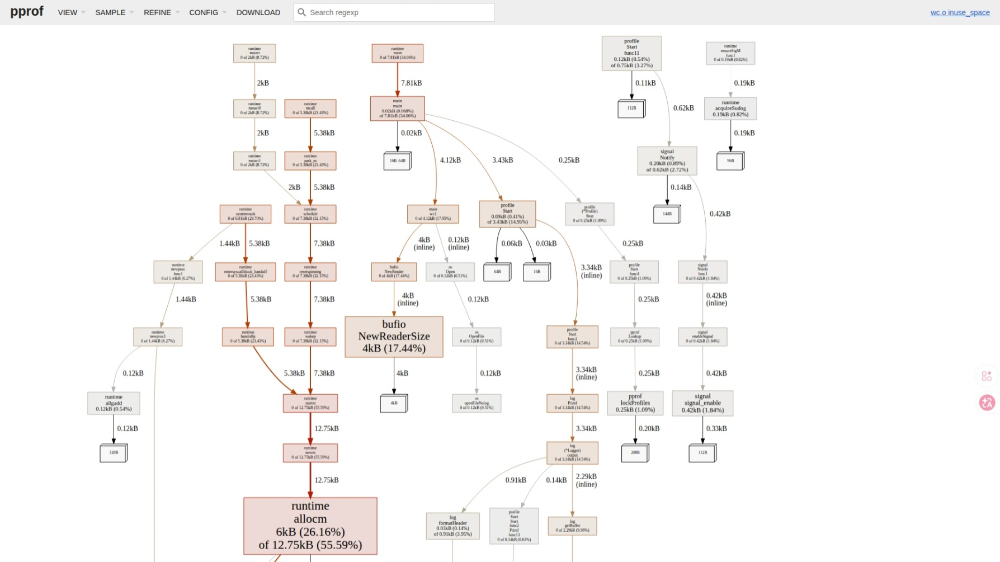
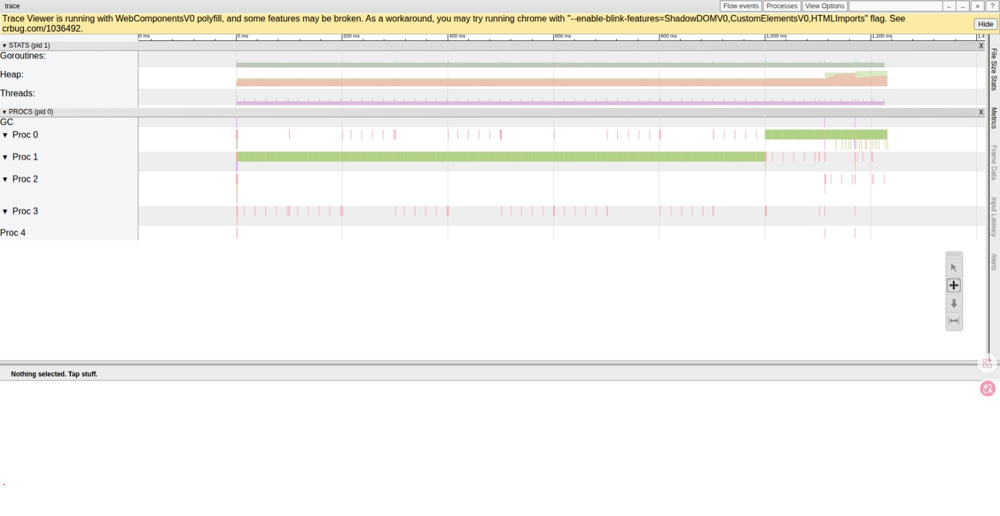
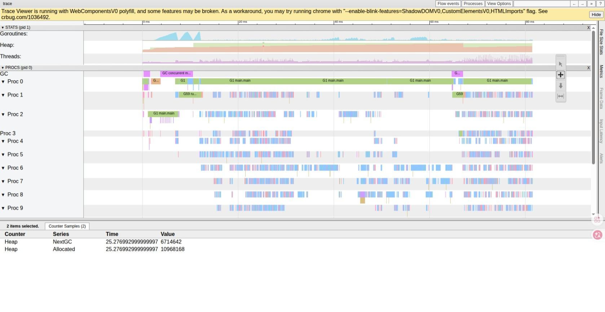
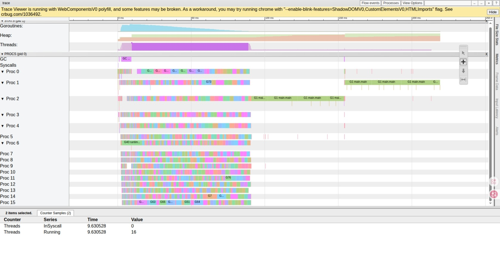
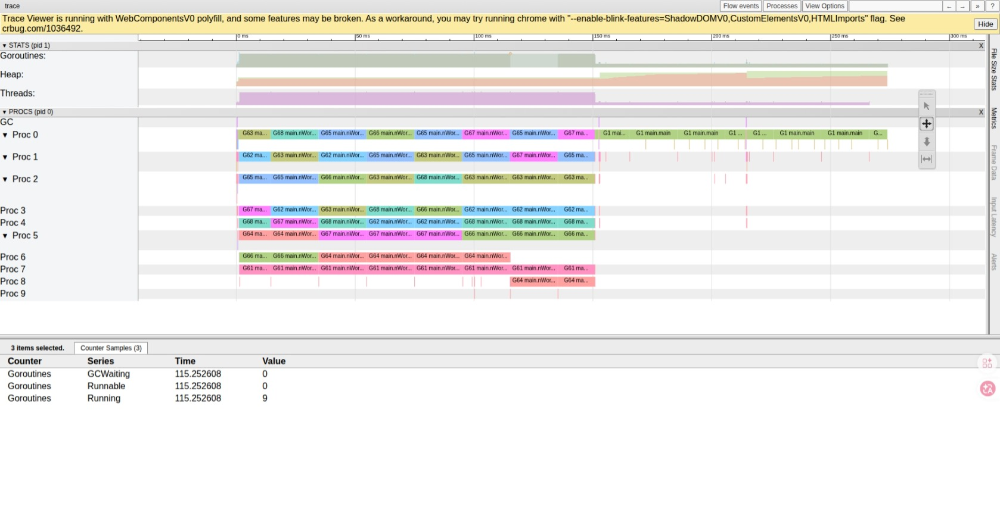

# Profiling trong Go 

## 1. Measure, don't guess

Tối ưu hiệu năng là một trong những kỹ năng dễ bị làm sai nhất trong nghề lập trình, vì trực giác của con người về máy tính gần như luôn luôn sai. Một dòng code trông “tốn kém” thực tế có thể chỉ chạy 0.1% thời gian; một biến tạm tưởng “rẻ tiền” lại tạo ra hàng triệu lần GC. Vì thế nguyên lý số 1 luôn là:

1. **Đo trước, sửa sau.** Không tối ưu khi chưa profile.
2. **Tối ưu phải có baseline.** Phải biết “trước khi sửa nó bao nhiêu giây” để xác định sửa có tác dụng không.
3. **Một thay đổi mỗi lần.** Đổi nhiều thứ song song → không biết cái nào tạo ra sự thay đổi.
4. **Profile production-like input.** Profile với input 100 byte không cho biết gì về hành vi trên file 500 MB.

Bài viết sẽ đi qua hai chương trình. Mỗi chương trình minh hoạ một **lớp bài toán khác nhau**:

| Chương trình | Bottleneck đặc trưng | Loại profiler chính | Bài học |
|--------------|----------------------|---------------------|---------|
| `wc` (đếm từ) | I/O, syscall, memory allocation | CPU + Memory pprof | Đi từ I/O nhỏ giọt → buffered → mmap |
| `mandelbrot` | CPU thuần, parallelism | Execution Tracer | CPU profile không đủ — cần trace để thấy scheduling |

---

## 2. Ba loại Profiler — Bản Chất Bên Trong

Trước khi bàn chuyện tối ưu, phải hiểu **mỗi profiler đo cái gì và đo bằng cách nào**, vì cơ chế đo quyết định cái nó có thể thấy (và không thể thấy).

### 2.1 CPU Profiler — Sampling

Cơ chế:

- Mỗi giây OS gửi khoảng **100 tín hiệu (`SIGPROF`)** vào tiến trình Go (mặc định 100Hz).
- Mỗi lần nhận tín hiệu, Go runtime **dừng goroutine đang chạy**, ghi lại **call stack hiện tại** của nó, rồi cho chạy tiếp.
- Sau khi chương trình kết thúc, profiler có một tập hợp `~ 100 × t (giây)` mẫu call stack. Hàm xuất hiện trong nhiều mẫu nhất = hàm tốn CPU nhất.

Hệ quả quan trọng:

- **Đây là thống kê, không phải đo trực tiếp.** Hàm chạy < 10ms có thể bị bỏ qua hoàn toàn.
- **Chỉ thấy được code đang chạy CPU.** Goroutine đang chờ I/O, đang ngủ, đang chờ lock — đều **không xuất hiện** trong CPU profile.
- **Tần số 100Hz là cố ý.** Cao hơn → overhead lớn, nhiễu kết quả; thấp hơn → bỏ sót.

Lúc nào dùng: khi nghi ngờ chương trình **CPU-bound** — tốn nhiều thời gian tính toán hoặc dùng nhiều CPU.

Lúc nào KHÔNG dùng: khi chương trình chậm vì *chờ* (I/O, mutex, channel). CPU profile sẽ chỉ cho thấy “runtime đang đi ngủ” chứ không nói tại sao.

### 2.2 Memory Profiler — Cộng Tác Với Runtime

Cơ chế:

- **Không sampling theo thời gian**, mà **theo allocation**. Mỗi lần Go runtime cấp phát một block trên heap, nó hỏi: "đây có phải lần thứ N cần ghi lại không?" (`MemProfileRate`, mặc định 1 trên 512 KB; trong code của ta đặt `MemProfileRate(1)` = ghi mọi allocation cho chính xác).
- Khi cần ghi, runtime lưu lại **call stack tại điểm allocation**, kèm số byte cấp phát.
- Profiler trả về hai loại số: **`alloc_space`/`alloc_objects`** (tổng đã cấp phát) và **`inuse_space`/`inuse_objects`** (còn sống tại thời điểm sample).

Hệ quả:

- Vì runtime tự ghi nên overhead **thấp hơn CPU profile rất nhiều**.
- Cho biết chính xác **chỗ nào trong code đang sinh rác**. Đây là vũ khí số 1 để diệt áp lực GC.
- Nhưng không nói gì về *thời gian* — chỉ về *byte*.

Đây là profiler dùng trong `wc/main.go`:

```go
defer profile.Start(profile.MemProfile, profile.MemProfileRate(1), profile.ProfilePath(".")).Stop()
```

### 2.3 Execution Tracer — Ghi Sự Kiện

Cơ chế:

- Khác với hai loại trên (sampling), tracer **ghi toàn bộ sự kiện** xảy ra trong Go runtime: goroutine bắt đầu, dừng, bị chặn, được đánh thức, syscall, GC, network poll…
- Mỗi sự kiện gắn timestamp nano giây + CPU/processor đang chạy.
- Kết quả mở bằng `go tool trace` → trình duyệt → timeline tương tác.

Hệ quả:

- **Thấy được tất cả những gì CPU profile không thấy**: goroutine bị chặn ở chỗ nào, chờ bao lâu, có bị scheduler đẩy qua đẩy lại giữa các CPU không, có thread starvation không.
- **Overhead cao hơn nhiều** (vì ghi sự kiện chứ không sample), nên không dùng cho production lâu dài; chạy vài giây để chẩn đoán là đủ.
- Đây là công cụ **không thể thiếu** cho mọi chương trình concurrent.

Đây là profiler dùng trong `mandelbrot/main.go`:

```go
defer profile.Start(profile.TraceProfile, profile.ProfilePath(".")).Stop()
```

### 2.4 Tóm tắt khả năng

| Profiler | Cơ chế | Thấy được | Không thấy được | Overhead |
|----------|--------|-----------|----------------|----------|
| CPU pprof | Sampling 100Hz call stack | Hàm tốn CPU | Wait/block, allocation | Trung bình |
| Memory pprof | Ghi tại allocation | Nơi sinh rác, bytes/objects | Thời gian | Thấp |
| Block/Mutex pprof | Ghi tại unblock | Chờ channel/lock | Allocation | Thấp |
| Tracer | Ghi mọi sự kiện runtime | Toàn bộ lifecycle goroutine, GC, scheduler | — | Cao |

Quy tắc chọn: **CPU profile để xem code tốn — Memory profile để xem code cấp phát — Tracer để xem code chờ.**

---

## 3. Case Study 1 — `wc`: Bốn Phiên Bản, Bốn Bài Học

Bài toán: đếm số từ trong một file văn bản, tương tự `wc -w` của Unix. Input baseline: **file 500 MB**.

### 3.1 `wc0` — Bản naive: đọc từng byte trực tiếp

```go
func readbyte0(f io.Reader) (rune, error) {
    var buff [1]byte
    _, err := f.Read(buff[:])
    return rune(buff[0]), err
}

func wc0(filePath string) int {
    f, _ := os.Open(filePath)
    defer f.Close()
    words, inword := 0, false
    for {
        r, err := readbyte0(f)
        if err == io.EOF { break }
        if unicode.IsSpace(r) && inword { words++; inword = false }
        if unicode.IsLetter(r) { inword = true }
    }
    return words
}
```

Kết quả đo:

```
51.46s user — 114.32s system — 100% cpu — 2:45.05 total
```

**Quan sát chìa khoá**: `system` time **lớn gấp đôi** `user` time. Đây là chỉ báo lập tức rằng chương trình **dành phần lớn thời gian trong kernel**, không phải trong code Go. Lý do: 500 triệu lần `Read()` = 500 triệu lần syscall = 500 triệu lần chuyển ngữ cảnh user ↔ kernel.

Bật CPU profile và mở bằng `go tool pprof -http=:8080 cpu.pprof` cho ra call graph như sau:



Đọc đồ thị này theo trục đứng — đây là **call graph có trọng số**, cạnh càng đậm/dày = càng tốn CPU. Đường dẫn nóng nhất rõ ràng:

```
main.main           430ms (100%)
  └─ main.wc0       430ms (100%)
       └─ main.readbyte0 430ms (100%)
            └─ os.(*File).Read   420ms (97.67%)
                 └─ poll.(*FD).Read 410ms (95.35%)
                      └─ syscall.Read   380ms (88.37%)
                           └─ syscall.Syscall6  310ms (72.09%)  ← đỉnh
                                └─ runtime.exitsyscall  30ms (6.98%)
```

Mấy điểm cần đọc cho đúng:

1. **`syscall.Syscall6` chiếm 72% thời gian CPU** (310 / 430 ms). Đây là *flat time* — tức 72% các mẫu mà profiler chộp được, call stack đang ở chính bên trong hàm này. Không phải “syscall chậm vì mã của nó tệ” — `Syscall6` chỉ là wrapper rất mỏng quanh instruction `SYSCALL` của CPU. Nó cao vì **được gọi 500 triệu lần**.

2. **Toàn bộ thân `wc0` không có nhánh nào khác**. Chiều rộng đồ thị = 1 cột thẳng. Không thấy `unicode.IsSpace`, không thấy `unicode.IsLetter` — chúng nhỏ đến mức bị "nuốt" bởi syscall, không đủ % để hiện. Tín hiệu cực rõ: bài toán không phải tính toán.

3. **`runtime.exitsyscall` 30 ms (6.98%)** + một nhánh `runtime.casgstatus` 10 ms (2.33%) ở dưới — đây là cost **Go runtime quản lý goroutine khi nó vào/ra syscall**. Mỗi syscall blocking → runtime đánh dấu goroutine "Gsyscall", có thể "hand-off" P sang goroutine khác, rồi khi syscall trả về phải đồng bộ lại trạng thái. 7% thời gian *không phải kernel cũng không phải tính toán* — chỉ là bookkeeping của scheduler vì gọi syscall quá nhiều.

4. **Nhánh phụ `poll.(*FD).rlock`/`rwunlock` 10–20 ms (2.33%/4.65%)**. Mỗi `Read` trên `*os.File` phải khoá `FD` để đảm bảo an toàn concurrent. 500 triệu lần `Read` = 500 triệu lần lock/unlock — một loại overhead nữa **không có trong logic nghiệp vụ**.

5. **`os.(*File).checkValid` 10 ms (2.33%)** — branch validate file descriptor mỗi lần `Read`. Cũng vô nghĩa khi gọi 500 triệu lần.

Cộng hết các nhánh "không phải logic đếm từ": `Syscall6` (72%) + `exitsyscall` (7%) + lock (7%) + `casgstatus` (2%) + `checkValid` (2%) ≈ **90% thời gian CPU đang phục vụ machinery của một `Read` 1 byte**.

> Cái bẫy lớn nhất khi đọc profile: đỉnh profile không phải "thứ cần tối ưu" — đó là **triệu chứng**. Câu hỏi đúng: *"tại sao hàm này gọi nhiều đến vậy?"* Hàm `syscall.Syscall6` không sửa được. Cái sửa được là **gộp 500 triệu lời gọi thành 125 nghìn** bằng buffer 4 KB. Đó chính xác là việc `bufio.NewReader` làm — và là lý do `wc1` nhanh thêm 50 lần dù không đổi gì logic.

Profile này cũng minh hoạ tại sao chỉ riêng `time` đã cho biết phải bật CPU profile: `system=114s >> user=51s` đã hét lên "kernel-bound". CPU profile chỉ xác nhận: 72% nằm trong `Syscall6`, mọi thứ khác là nhiễu.

### 3.2 `wc1` — Thêm `bufio` + chia sẻ buffer

Sửa thứ nhất: bọc reader bằng `bufio.NewReader` để gom syscall theo block (mặc định 4 KB):

```go
b := bufio.NewReader(f)
for {
    r, err := readbyte(b)
    ...
}
```

Kết quả ngay lập tức:

```
55.75s user — 0.16s system — 104% cpu — 53.36s total
```

`system` time gần như biến mất (114s → 0.16s). Total time giảm 5 lần, 99% chi phí của `wc0` không phải tính toán mà là syscall overhead.

Nhưng vẫn còn vấn đề thứ hai. Bật **Memory profile** cho thấy `readbyte` đang cấp phát rất nhiều memory. Tại sao? Hàm gốc:

```go
func readbyte(f io.Reader) (rune, error) {
    var buff [1]byte                  // <- mảng cục bộ
    _, err := f.Read(buff[:])
    return rune(buff[0]), err
}
```

Nhìn thì `buff` là biến cục bộ trên stack — đáng lẽ rất rẻ. Nhưng `f` có kiểu **interface** `io.Reader`. Khi gọi `f.Read(buff[:])`, compiler không biết bên dưới interface là implementation nào, **không thể chắc rằng `buff` không bị giữ tham chiếu sau khi hàm trả về**. Escape analysis kết luận: an toàn hơn cứ đẩy lên **heap**.

Hệ quả: **mỗi lần đọc một byte = một allocation trên heap = áp lực lên GC**.

Mở `mem.pprof` với view `inuse_space` (bộ nhớ còn sống tại snapshot) cho ra đồ thị sau:



Đọc call graph từ trên xuống:

```
runtime.main         1232.70 kB (98.36%)
  └─ main.main       1232.70 kB (98.36%)   self: 0.03 kB
       └─ main.wc1   1228.74 kB (98.05%)
            └─ main.readbyte0  1224.62 kB (97.72%)  ← đỉnh tuyệt đối
```

Quan sát:

1. **`readbyte0` giữ 97.72% inuse heap** trong khi nó chỉ chứa duy nhất `var buff [1]byte` và một dòng `f.Read`. Một hàm "trông như stack-only" lại chiếm gần như toàn bộ heap đang sống.

2. **Box `wc1` self là 0%** — vòng lặp đếm từ không tự cấp phát gì. Toàn bộ rác sinh ra từ allocation lặp lại bên trong `readbyte0`.

3. **Cột phải của đồ thị (`runtime.mstart`, `schedule`, `wakep`, …) chỉ chiếm ~12.75 kB** — đó là cost cố định của Go runtime (goroutine stacks, scheduler structs). Không đáng kể so với 1.2 MB do user code sinh ra.

4. **Allocation site rõ ràng**: profile chỉ thẳng vào `readbyte0`, không cần đoán dòng. Đây là sức mạnh của memory profile so với guesswork — `var buff [1]byte` trông vô hại trên màn hình text, nhưng escape analysis đã quyết định đưa nó lên heap, và profile xác nhận hậu quả.

Vì sao escape? Vì `f` là interface `io.Reader`. Khi compiler thấy `f.Read(buff[:])`, nó không biết implementation thực sự của `Read` sẽ làm gì với slice — có thể lưu pointer vào đâu đó. Để an toàn, compiler đẩy `buff` lên heap. Kiểm tra bằng:

```bash
go build -gcflags='-m=2' ./golang/wc/
# ... main/main.go:21:6: moved to heap: buff
```

**Fix**: nâng `buff` thành biến global, tái sử dụng một buffer duy nhất:

```go
var buff [1]byte

func readbyte(f io.Reader) (rune, error) {
    _, err := f.Read(buff[:])
    return rune(buff[0]), err
}
```

Profile lại với shared buffer:



Đồ thị thay đổi hoàn toàn về *hình dạng* lẫn *quy mô*:

1. **Box `main.main` chỉ còn 7.81 kB** (so với 1232.70 kB trước). Tổng inuse user-code giảm **~157 lần**.

2. **Không còn box `readbyte` đỏ rực**. Allocation site cũ biến mất khỏi top — `readbyte` giờ không cấp phát gì vì `buff` global đã được cấp một lần lúc khởi động và tái sử dụng mãi mãi.

3. **Đỉnh mới là `runtime.allocm` 12.75 kB (55.59%)** + `bufio.NewReaderSize` 4 kB (17.44%) + một số node `runtime.systemstack`, `wakep`, `mcall`, `schedule`. Tất cả đều là **chi phí một lần** của runtime + một lần khởi tạo `bufio.Reader` 4 KB. Không scale theo kích thước file.

4. **Đồ thị phình rộng nhưng các box rất nhỏ** (KB chứ không MB). Đó là dấu hiệu "lành mạnh": cost rải đều giữa nhiều thành phần runtime, không có hot spot nào áp đảo.

5. **Một số nhánh phụ xuất hiện** (`profile.Start`, `signal.Notify`, `log.Print`…) chỉ là cost của bản thân profiler và logger — chúng luôn có, chỉ là trước kia bị làm cho vô hình bởi 1.2 MB rác từ user code.

So sánh trực diện hai profile:

| Metric | Local `buff` | Global shared `buff` | Tỉ lệ |
|--------|--------------|----------------------|-------|
| `main.main` inuse | 1232.70 kB | 7.81 kB | **/158** |
| `readbyte*` inuse | 1224.62 kB | ~0 kB | **/∞** |
| Đỉnh đồ thị | `readbyte0` (user code) | `runtime.allocm` (runtime fixed cost) | bản chất thay đổi |
| Total time | 53.36 s | 3.36 s | **/16** |

Tốc độ tăng 16 lần không đến từ ít CPU instructions hơn — `readbyte` thực hiện cùng số phép tính. Nó đến từ:

- **Bỏ áp lực lên GC**. Cấp phát 500 triệu lần slice 1-byte → GC phải quét và thu hồi liên tục. Mỗi GC cycle là một stop-the-world (ngắn nhưng cộng dồn lại đáng kể) + đốt CPU cho mark/sweep.
- **Cache locality**. Một biến global luôn ở cùng địa chỉ → CPU cache hot. 500 triệu allocation khác nhau → mỗi lần một địa chỉ mới → cache miss liên tục.
- **Đường đi qua allocator**. Mỗi `mallocgc` phải đi qua mcache → mcentral (đôi khi mheap), kiểm tra size class, cập nhật bookkeeping. Bỏ allocation = bỏ toàn bộ đường này.

Kết luận:

- **Interface ẩn cost.** Truyền dữ liệu qua hàm nhận interface có thể buộc dữ liệu lên heap, dù logic không có lý do nào để escape.
- **Memory profile là cách duy nhất để thấy điều này.** CPU profile có thể cho thấy `mallocgc` hoặc `runtime.gcBgMarkWorker` cao, nhưng không chỉ thẳng vào *dòng nào trong code* gây ra điều đó. Memory profile làm được.
- **Đỉnh đồ thị thay đổi = signal**. Khi đỉnh chuyển từ "user function" sang "runtime fixed cost", tức là đã hết chỗ tối ưu allocation ở user level. Tiếp theo phải chuyển hướng (`mmap` ở `wc2`).
- Trước khi "tối ưu thuật toán", luôn hỏi: chương trình có đang sinh rác không?

### 3.3 `wc2` — `mmap`: Bỏ syscall hoàn toàn

Đến đây CPU profile cho thấy thời gian phân tán đều ở `unicode.IsSpace`/`unicode.IsLetter` và vòng đọc. Đã không còn dễ tối ưu ở mức code. Câu hỏi cấp cao hơn: **có cách nào để chương trình không cần `Read()` chút nào?**

Có: **memory-mapped I/O**. Hệ điều hành ánh xạ file vào không gian địa chỉ của tiến trình; mỗi truy cập byte trông giống truy cập một mảng trong RAM. Kernel sẽ lazy-load các trang khi được chạm vào (demand paging), và **không có syscall trong vòng lặp đọc**.

```go
f, _ := mmap.Open(filePath)
defer f.Close()
for i := 0; i < f.Len(); i++ {
    r := rune(f.At(i))
    if unicode.IsSpace(r) && inword { words++; inword = false }
    if unicode.IsLetter(r) { inword = true }
}
```

Kết quả: **1.74s total** với cùng input 500 MB.

Đáng chú ý: code này hoàn toàn **single-threaded** — chỉ chạy trên một CPU core. Nhưng vì đã bỏ được toàn bộ overhead của `Read()` và buffer copy, nó vẫn nhanh hơn `wc1` (3.36s) thêm 2 lần.

### 3.4 ASCII lookup table — bỏ `unicode.IsLetter` / `unicode.IsSpace`

Sau khi `wc2` đã loại bỏ syscall + allocation, profile lại sẽ thấy đỉnh chuyển sang `unicode.IsLetter` và `unicode.IsSpace`. Đây là bottleneck mới — và nó cũng không nhỏ.

**Vì sao `unicode.IsLetter` đắt**:

```go
func IsLetter(r rune) bool {
    if uint32(r) <= MaxLatin1 {
        return properties[uint8(r)]&pLmask != 0
    }
    return isExcludingLatin(Letter, r)
}
```

- Phải xử lý toàn bộ Unicode range (0..0x10FFFF), không chỉ ASCII.
- Cho code point > 0xFF: nhị phân search trên bảng range → ~10 lần so sánh.
- Function call qua interface boundary — không inline được vì có branch + bảng external.

Trên 500 MB ASCII text, gọi `IsLetter` 500 triệu lần = phần lớn CPU time.

**Quan sát chìa khoá**: input của chúng ta là **ASCII**. 99% byte trong `[0, 127]`. Không cần Unicode logic chút nào. Có hai cách rút gọn:

#### Cách 1 — Lookup table

Tiền tính bảng 256 byte tại `init()`:

```go
var isSpaceASCII [256]bool

func init() {
    for c := 0; c < 256; c++ {
        b := byte(c)
        isSpaceASCII[b] = b == ' ' || b == '\t' || b == '\n' ||
                          b == '\r' || b == '\v' || b == '\f'
    }
}

// dùng trong hot loop
if isSpaceASCII[c] && inword { ... }
```

- 1 lệnh load: `MOV AL, [base + RCX]` — 4-5 cycle L1 hit.
- Table 256 byte luôn nằm L1 sau lần truy cập đầu tiên (working set rất nhỏ).
- Phù hợp với **các predicate phân tán** không thể rút thành biểu thức số học, ví dụ `isSpace` — 6 ký tự rời rạc (`' '`, `\t`, `\n`, `\r`, `\v`, `\f`) không liền nhau, không có range nhỏ gọn.

#### Cách 2 — Branchless arithmetic

Cho predicate có thể biểu diễn bằng range check, dùng số học thuần trên register:

```go
// ASCII letter [A-Za-z], không cần table
func isLetterFast(b byte) bool {
    return (b|0x20)-'a' < 26
}
```

Trick: `b | 0x20` ép chữ in hoa về chữ thường (bit 5 = 1) — `'A' | 0x20 = 'a'`. Sau đó `letter ↔ kết quả ∈ ['a', 'z']` ↔ `(result - 'a') < 26`. 3 instruction: `OR + SUB + CMP`, 0 memory access, 0 cache pollution. CPU OoO có thể dispatch nhiều byte song song qua superscalar execution.

#### So sánh trực diện

| | Lookup table | Branchless |
|---|---|---|
| Cơ chế | `MOV reg, [base + idx]` | `OR + SUB + CMP` |
| Memory access | 1 load (L1) | 0 |
| Latency | 4-5 cycle | 1-3 cycle, fully pipelined |
| Cache pressure | 256 byte L1 | 0 |
| ILP (parallel byte) | Bị giới hạn load port (~2/cycle) | CPU dispatch 4+ byte/cycle |
| Hot path inline | Compiler có thể inline load | Luôn inline trực tiếp |
| Predicate phù hợp | Phân tán (`isSpace`) | Range gọn (`isLetter`, digit) |

**Khi nào table thắng**:
- Predicate gồm nhiều ký tự rời rạc không liền kề. Nếu branchless cần 5-6 OR/CMP thì 1 load + 1 cmp rẻ hơn.
- Đa-predicate cùng index byte: 1 load của `c`, rồi truy cập nhiều bảng `isSpace[c]`, `isLetter[c]`, `isDigit[c]` cùng register `c`.

**Khi nào branchless thắng**:
- Hot loop hàng tỷ byte, working set lớn — table có thể bị evict, miss L1.
- Predicate là range hẹp — chi phí số học < cost của load + memory dependency.
- Cần tận dụng superscalar / ILP — branchless không tạo dependency chain qua memory.

#### Áp dụng cho `wc`

Trong code:

```go
// boundary skip: 1 predicate đơn giản → branchless thắng
for start < fileSize && isLetterFast(data[start-1]) {
    start++
}

// hot loop main: 2 predicate (space + letter) cùng byte c → table đồng nhất
for i := start; i < end; i++ {
    c := data[i]
    if isSpaceASCII[c] && inword { words++; inword = false }
    if isLetterFast(c)        { inword = true }
}
```

Mix: `isSpaceASCII` table (vì 6 ký tự rời rạc), `isLetterFast` branchless (vì range gọn). Tận dụng điểm mạnh của từng kỹ thuật.

#### Cạm bẫy: bỏ `rune`

`unicode.IsLetter(r rune)` yêu cầu param `rune` (int32). Code cũ phải cast `byte → rune` mỗi lần:

```go
r := rune(f.At(i))  // 1 cast/byte
if unicode.IsSpace(r) ...
```

Cast `byte → rune` chỉ là zero-extend, miễn phí ở CPU level. Nhưng nó là **dấu hiệu mặt nạ Unicode** — code đang giả vờ handle Unicode trong khi thực ra chỉ đọc 1 byte/lần.

Với input UTF-8 multibyte (tiếng Việt `'á' = 0xC3 0xA1`, tiếng Trung `'我' = 0xE6 0x88 0x91`):
- Code byte-at-a-time + cast `rune` → mỗi byte UTF-8 bị check riêng. Byte 0xC3 không phải letter trong Unicode table → đếm sai.
- Đúng phải dùng `bufio.Reader.ReadRune()` hoặc `utf8.DecodeRune(data[i:])`.

`wc4` trở đi chấp nhận giới hạn ASCII-only để đổi lấy tốc độ. Trade-off rõ ràng: **giả định nhỏ hơn về dữ liệu = code nhanh hơn**.

#### Kết quả đo

Với input 500 MB ASCII (`big.txt`):

| Phiên bản | Total time | Speedup so với `wc2` |
|-----------|-----------|---------------------|
| `wc2` (unicode + mmap) | 1.74s | baseline |
| `wc2` + ASCII (table + branchless) | ~0.4-0.6s | 3-4× |

Tỉ lệ tiết kiệm: 60-75% CPU time chỉ bằng việc thay 2 hàm Unicode bằng 1 table + 1 phép số học. Cùng thuật toán, cùng mmap, không thêm parallelism — chỉ bỏ overhead `unicode.IsLetter`/`IsSpace`.

#### Bài học chung

- **Generality có giá**. `unicode.IsLetter` đúng với mọi script Unicode → đắt. Nếu ràng buộc input cho phép (ASCII-only), thay bằng version chuyên dụng.
- **Profile chỉ thẳng cost của abstraction**. Không có profile, không ai nghĩ `unicode.IsLetter` chiếm 70% CPU — trông như "1 phép kiểm tra đơn giản".
- **Table vs branchless không phải either-or**. Trộn cả hai theo bản chất từng predicate.
- **Khi đỉnh profile chuyển sang hàm library**, đó là dấu hiệu nên "viết lại version chuyên dụng" thay vì "tối ưu code xung quanh".

### 3.5 Tổng kết từ `wc`

| Phiên bản | Total time | Insight |
|-----------|-----------|---------|
| `wc0` | 165s | Syscall không chậm, nhưng gọi quá nhiều thì chậm. `system >> user` ⇒ kernel-bound. |
| `wc1` (no shared buff) | 53s | Buffered I/O xoá overhead syscall. |
| `wc1` (shared buff) | 3.4s | Escape vì interface → allocation. Mem profile là chìa khoá. |
| `wc2` | 1.7s | mmap bỏ luôn `Read()`. Đổi mô hình thay vì tối ưu vòng lặp. |
| `wc2` + ASCII | ~0.5s | Bỏ overhead `unicode.IsLetter`/`IsSpace`. Giả định ASCII-only đổi lấy 3-4× speedup. |

**Tỉ lệ tăng tốc tổng: ~1000-1500 lần** từ `wc0` đến phiên bản ASCII. Không có bước nào trong số này dựa vào trực giác — mỗi bước được dẫn dắt bởi một profile cụ thể.

Đáng chú ý: **mỗi bước tối ưu lại làm lộ bottleneck mới**. Syscall biến mất → allocation lộ ra. Allocation biến mất → `Read()` lộ ra. `Read()` biến mất → `unicode.IsLetter` lộ ra. Profile không phải kỹ năng "tìm ra mọi vấn đề một lần"; nó là **vòng lặp**: profile → fix top item → profile lại.

---

## 4. Case Study 2 — `mandelbrot`: Khi CPU Profile Không Đủ

Bài toán: render ảnh tập Mandelbrot 1024×1024 thành PNG. Mỗi pixel là một phép tính độc lập (`fillPixel`), lý tưởng để song song hoá.

Bốn mode được cài đặt:

| Mode | Mô tả |
|------|------|
| `seq` | Vòng `for` đơn luồng |
| `px` | Một goroutine mỗi pixel |
| `row` | Một goroutine mỗi hàng |
| `workers` | Worker pool cố định (N worker, channel chia việc) |

### 4.1 Lý do CPU profile *không phải* công cụ ở đây
Chạy CPU profile lên `seq`: đỉnh chắc chắn là `fillPixel`. Nhưng `fillPixel` là **công việc bắt buộc** — không thể bỏ. CPU profile không gợi ý được gì.

Vấn đề thực sự nằm ở **goroutine scheduling**: mỗi mode tận dụng (hoặc không tận dụng) nhiều core thế nào. Đây là lúc **execution tracer** lên ngôi.

```go
defer profile.Start(profile.TraceProfile, profile.ProfilePath(".")).Stop()
```

Mở bằng `go tool trace trace.out`. Cái ta nhìn vào: timeline của các "processor" (P0, P1, …, Pn-1 = NumCPU), mỗi P hiển thị các goroutine đang chạy trên nó theo thời gian.

### 4.2 `seq` — Single thread



Đọc trace từ trên xuống:

1. **STATS panel** (`Goroutines`, `Heap`, `Threads`): đường gần như phẳng. Goroutine count thấp và ổn định (1 worker + runtime), heap nhỏ, threads cố định. Tín hiệu: chương trình **không tạo thêm goroutine nào trong giai đoạn tính toán**.

2. **PROCS panel** (Proc 0 – Proc 4): chỉ **Proc 1 có một dải xanh liên tục từ ~0ms đến ~1280ms** — đó là `seqFillImg` chạy suốt từ đầu đến cuối trên một processor duy nhất. Proc 0, 2, 4 gần như trống. Proc 3 chỉ có vài vạch đỏ rời rạc (GC assist ngắn). Total wall time ~1.3 giây.

3. **Đoạn ~1000–1400 ms**: Proc 0 đột nhiên có một dải xanh dày. Đây không phải tính mandelbrot — đó là `png.Encode` chạy sau khi vòng `seqFillImg` kết thúc. PNG encoder bản thân nó cũng single-threaded với một số overhead allocation (heap bắt đầu nhô lên trong panel `Heap`).

4. **Đường line GC**: hầu như không thấy. Chương trình không sinh allocation đáng kể trong vòng tính toán (mỗi `fillPixel` chỉ ghi vào ô `[][]color.RGBA` đã pre-allocate), nên GC không phải làm việc nhiều.

Tổng kết quan sát: **4/5 processor ngồi không trong 1.3 giây**. Đây chính là cái CPU profile *không thể nói cho biết*. CPU profile của bản này sẽ chỉ thấy `fillPixel` ở đỉnh và kết luận "công việc nặng" — nhưng đó là công việc *bắt buộc*; vấn đề là nó chạy nối tiếp trên một core trong khi cả máy có nhiều core nhàn rỗi.

### 4.3 `px` — Một goroutine mỗi pixel: song song hoá *quá mức*

Trực giác: tạo nhiều goroutine = chạy nhanh hơn. Thực tế: với 1024×1024 = 1.048.576 goroutine, mỗi cái làm một phép tính bé tí, thì chi phí scheduler **vượt xa công việc thật**:

- Cấp phát goroutine, đặt vào hàng đợi scheduler.
- Scheduler điều phối, đẩy goroutine vào P, chạy, gọi `wg.Done()`.
- Cache pollution: goroutine bị chuyển giữa các core, dữ liệu pixel phải đi qua các tầng cache.



Trace ở mode này khác hoàn toàn:

1. **STATS panel — `Goroutines` counter**: đồ thị hình răng cưa rất gắt, **xanh lá nhô lên thành các đỉnh nhọn liên tục**. Mỗi đỉnh là vài chục đến vài trăm goroutine cùng tồn tại trong một khoảnh khắc. Đây là minh chứng trực quan cho việc spawn 1.048.576 goroutine trong một khoảng thời gian rất ngắn.

2. **STATS panel — `Heap`**: đường heap **tăng tuyến tính** trong suốt thời gian chạy. Counter sample ở đáy panel cho biết `Heap.Allocated = 10968168` (~10.9 MB) và `NextGC = 6714642`. Heap đã vượt ngưỡng GC nhiều lần. Đây là cost gián tiếp: mỗi goroutine `go func(i, j int) {...}` mang theo một stack tối thiểu (~2 KB) và một `runtime.g` struct — ngay cả khi goroutine ngắn ngủi, hệ thống vẫn phải cấp phát rồi dọn dẹp.

3. **GC line ngay trên Proc 0**: xuất hiện ô tím **`GC concurrent m...`** ngay đầu timeline + nhiều marker GC rải rác sau đó. So với mode `seq` không có GC, đây là cost mới hoàn toàn — sinh ra chỉ vì cách spawn goroutine.

4. **PROCS panel**: tất cả 10 processor đều có hoạt động, nhưng kiểu hoạt động khác hẳn `seq` — **các tile rất hẹp, rất nhiều màu** xen kẽ liên tục. Mỗi tile = một goroutine được schedule lên P, chạy vài chục đến vài trăm nano giây, rồi nhường chỗ. Pattern này gọi là **"shotgun scheduling"** — scheduler bắn liên tục, công việc bị phân mảnh.

5. **Timeline tổng**: zoom ở ảnh là 0–80ms chỉ là một lát cắt nhỏ; tổng thời gian thực tế dài hơn `row` mode dù tận dụng nhiều P hơn. Lý do: phần lớn thời gian các P đang chạy **code scheduler** (`runtime.schedule`, `runtime.findRunnable`, `runtime.execute`) chứ không phải `fillPixel`.

Tỉ lệ overhead/work ≈ **3-6×**. Scheduler đang là bottleneck, không phải CPU tính toán.

> **goroutine không miễn phí**. Chúng rẻ hơn thread OS hai bậc, nhưng vẫn có cost cấp phát stack, đăng ký runqueue, đánh thức M (machine), GC bookkeeping. Quy tắc thực dụng: mỗi goroutine nên giữ **đủ việc để công việc lớn hơn cost khởi tạo ít nhất một bậc** (thường ≥ vài µs công việc). Khi không chắc, hãy đo `row` mode trước rồi mới chia nhỏ hơn nếu cần.

### 4.4 `row` — Một goroutine mỗi hàng: cân bằng tốt



1024 goroutine, mỗi cái tính 1024 pixel. Trace cho thấy hình ảnh hoàn toàn khác cả `seq` lẫn `px`:

1. **STATS — `Threads` counter**: hiển thị `Threads.Running = 16`, `Threads.InSyscall = 0`. Tất cả 16 thread OS đều bận chạy code Go — không có thread nào bị block trong syscall. Đây là dấu hiệu chương trình đang **dùng hết khả năng song song của máy**.

2. **STATS — `Goroutines` counter**: hình tam giác giảm dần — bắt đầu ~1024 goroutine, giảm tuyến tính về 0 khi từng hàng hoàn thành. Khác với `px` mode (răng cưa, spawn/destroy liên tục), ở đây goroutine được spawn một lần ở đầu rồi từ từ tiêu thụ.

3. **PROCS panel — tất cả 16 P (Proc 0–Proc 15) đều có dải màu dày trong giai đoạn 0–180ms**. Mỗi tile là một goroutine xử lý một hàng — to hơn đáng kể so với `px` mode (1024 pixel × ~500ns ≈ 0.5ms công việc trên mỗi tile). Đủ lớn để scheduler không bị overload.

4. **Sau ~180ms, hoạt động đột ngột thu lại về Proc 1 và Proc 2**: dải xanh `G1 main.main` xuất hiện — đây là `png.Encode` chạy sau khi tất cả goroutine compute đã `wg.Done()`. Pha này tuần tự, kéo dài ~70ms. Tổng wall time ~250ms.

Speedup so với `seq`: ~5× wall-clock (1.3s → 0.25s). Không phải 16× dù có 16 thread, lý do:
- **Pha PNG encoding tuần tự** chiếm ~28% wall time, không song song được.
- **Cache contention nhẹ**: 16 goroutine cùng ghi vào `[][]color.RGBA`. Các hàng cạnh nhau có thể nằm cùng cache line → false sharing.
- **Hyperthreading không tuyến tính**: 8 core vật lý + 8 SMT thread = 16 logical CPU, nhưng SMT chỉ tăng throughput ~20-30% chứ không gấp đôi.

Đây là điểm "sweet spot": goroutine nhiều hơn nhân (1024 >> 16, để runtime có dư hàng đợi khi một goroutine bị tạm dừng), nhưng mỗi goroutine làm đủ công việc (0.5ms) để cost spawn (~1µs) trở thành không đáng kể.

### 4.5 `workers` — Worker pool cố định: tinh chỉnh thêm

Tạo đúng N worker = số CPU. Mỗi worker đọc index hàng từ buffered channel, xử lý đến khi channel đóng.

```go
c := make(chan int, 1024)
for i := 0; i < workers; i++ {
    go func() {
        for i := range c {
            for j := range m.m[i] { fillPixel(m, i, j) }
        }
        wg.Done()
    }()
}
for i := range m.m { c <- i }
close(c)
```



So sánh trực diện trace của `workers` với `row`:

1. **STATS — `Goroutines` counter**: gần như phẳng ở mức thấp suốt giai đoạn compute. Counter sample ghi nhận `Goroutines.Running = 9, Runnable = 0, GCWaiting = 0` — tức 8 worker + 1 main, không có goroutine nào đang chờ runqueue, không có goroutine nào bị block. So với `row` (1024 goroutine tồn tại song song, scheduler phải quản lý hàng đợi lớn), đây là trạng thái "tinh gọn" hơn.

2. **PROCS panel — chỉ 8 P đầu (Proc 0–Proc 7) hoạt động**, đúng bằng số worker. Proc 8, Proc 9 trống suốt — vì chỉ có 8 worker được spawn (`workers=8`), runtime không có goroutine nào để đẩy lên các P khác.

3. **Các tile to và đều màu**: nhãn dạng `G62 main.nWorker...`, `G63 main.nWorker...`. Mỗi worker (G62–G68) chiếm trọn một P trong thời gian dài, **bám rất chặt vào processor đó** — Proc 0 chủ yếu chạy G63, G68; Proc 1 chủ yếu G65, G62; v.v. Đây là **affinity tự nhiên** sinh ra do worker không bao giờ exit (chỉ block trên `<-c`), nên scheduler không có lý do để di chuyển nó.

4. **Heap và Threads** ổn định trong suốt timeline, không có spike — không spawn goroutine mới, không có GC trong pha compute.

5. **Tail PNG encoding ~150ms trở đi**: tương tự `row`, các P chuyển sang chạy `G1 main.main` = encode PNG. Phần này không khác giữa hai mode.

Trên benchmark, wall time của `workers` thường **chỉ nhỉnh hơn `row` rất ít** (đôi khi chậm hơn vì có thêm channel overhead). Lý do:

- **Go scheduler có work-stealing**: ngay cả ở `row` mode với 1024 goroutine ngắn, runtime tự động phân tán đều giữa các P. Lợi ích affinity của worker pool đã có sẵn trong scheduler ở mức độ đáng kể.
- **Channel có cost**: mỗi `c <- i` + `<-c` là một thao tác đồng bộ qua mutex + condvar. Với 1024 messages, cost cộng dồn ngang ngửa cost spawn 1024 goroutine.
- **`fillPixel` là CPU pure**: không có syscall, không có block — scheduler không cần phải làm gì thông minh. Work-stealing đã đủ.

Khi nào worker pool **thật sự** hơn `row`-style: khi mỗi đơn vị công việc có syscall hoặc cần tài nguyên hạn chế (DB connection, file handle, semaphore), pool cho phép **kiểm soát concurrency** — không có cách nào làm điều này với `go func()` không giới hạn.

> **Đừng dùng worker pool chỉ vì nó nghe có vẻ tối ưu**. Khi mỗi đơn vị công việc lớn (như xử lý 1 hàng = 1024 pixel), `go func() {…}()` đơn giản đã hoạt động rất tốt. Chỉ chuyển sang worker pool khi: đơn vị công việc nhỏ + cần affinity rõ ràng; cần giới hạn concurrency (DB pool, HTTP downstream); cần backpressure (channel có buffer giới hạn).

---

## 5. Workflow Tối Ưu — Một Khung Tư Duy Có Hệ Thống

Tổng hợp từ hai case study, đây là quy trình lặp khuyên dùng:

### Bước 1 — Thiết lập baseline có thể tái sản xuất

- Một input cố định (`big.txt`, ảnh mandelbrot 1024×1024).
- Một metric duy nhất, đo bằng `time` hoặc `testing.Benchmark`.
- Chạy nhiều lần, lấy trung vị; nhiệt độ CPU và load máy đều ảnh hưởng.

### Bước 2 — Đọc tín hiệu tổng thể trước khi profile

`time` cho 3 con số: `user`, `system`, `real`.

- `system >> user` → kernel-bound (syscall, I/O). Bật CPU profile sẽ thấy đỉnh ở syscall hàm — đừng tối ưu hàm syscall, hãy **giảm số lần gọi**.
- `user >> real` (user time > wall time) → đang dùng nhiều CPU = parallel hoạt động.
- `real >> user` (wall time lớn nhưng CPU thấp) → đang chờ (I/O, lock, sleep). Đây là dấu hiệu cần **tracer**, không phải CPU profile.

### Bước 3 — Chọn profiler đúng

| Triệu chứng | Profiler |
|-------------|----------|
| CPU cao, real ≈ user | CPU profile |
| Bộ nhớ tăng / GC nhiều | Memory profile |
| CPU thấp nhưng chậm | Block / Mutex profile, Tracer |
| Concurrent code chậm | Tracer (bắt buộc) |
| Latency p99 cao | Tracer + block profile |

### Bước 4 — Đọc profile như *bằng chứng*, không như *kết luận*

- Đỉnh profile là **triệu chứng**, không phải bệnh. Luôn hỏi *“tại sao hàm này đắt?”* hoặc *“tại sao nó được gọi nhiều?”*.
- Xem flat vs cumulative: flat = chính hàm này tốn; cum = hàm này và mọi thứ nó gọi.
- Dùng `pprof -http=:8080` rồi xem **flame graph**: trục x là tỉ lệ thời gian, chiều cao là độ sâu call stack. Mặt phẳng rộng → hotspot; tháp mỏng → call chain dài.

---

## 6. Các Câu Hỏi Có Hệ Thống Cần Tự Đặt Ra

Mỗi lần nhìn profile, đây là danh sách câu hỏi nên đi qua:

**Về CPU profile:**
- Hàm nào ở đỉnh? Nó là *công việc cần thiết* hay *overhead*?
- Có hàm runtime nào lớn không? `runtime.mallocgc` lớn ⇒ GC pressure. `runtime.gcMarkDone` lớn ⇒ heap đang quét.
- `syscall.*` lớn ⇒ I/O không buffered.
- `runtime.futex` / `runtime.lock2` lớn ⇒ lock contention.

**Về memory profile:**
- Hàm nào cấp phát nhiều nhất (alloc_space)? Có cần thiết không?
- Có vòng lặp nào cấp phát trong thân không? Có thể chuyển ra ngoài / dùng `sync.Pool` không?
- Object nào còn sống lâu (inuse_space cao)? Có rò rỉ không?
- Tại sao biến X lại escape? Chạy `go build -gcflags="-m" ./...` để xem escape analysis.

**Về tracer:**
- Tất cả các P có bận không? Nếu không — chương trình không parallel.
- Goroutine có bị block lâu không? Block ở đâu (syscall / chan / sync)?
- GC có chiếm tỉ lệ lớn timeline không?
- Goroutine có “nhảy” giữa các P liên tục không? (cache thrashing)

---

## 7. Những Bẫy Thường Gặp

1. **Profile khi build có `-race`.** Race detector làm chương trình chậm 5–20×. Tắt trước khi đo hiệu năng.
2. **Profile trên dữ liệu giả nhỏ.** Hành vi của allocator, GC, scheduler khác hoàn toàn ở quy mô lớn.
3. **Quên warm-up.** Lần chạy đầu mất thời gian load file vào page cache. So sánh “cold run” với “cold run”, “warm run” với “warm run”.
4. **Đo trên máy đang chạy nhiều thứ.** Đóng IDE, browser, Slack trước khi đo nghiêm túc.
5. **Bật `MemProfileRate(1)` ở production.** Overhead lớn. Mặc định 512 KB là ổn cho production; chỉ đặt 1 khi debug cục bộ (như trong `wc/main.go`).
6. **Đọc CPU profile cho code I/O-bound.** Sẽ chỉ thấy `runtime.netpoll` và bối rối; tracer mới là công cụ đúng.
7. **Tin vào microbenchmark.** Loop test 1µs có thể bị inline / CSE / dead-code-eliminate. Dùng `b.ReportAllocs()`, `runtime.KeepAlive`, và kiểm tra disassembly.

---

## 8. Tổng Kết

Profiling không phải kỹ năng "tìm hàm chậm". Đó là kỹ năng **đặt câu hỏi đúng** ở mỗi bước. Bộ ba `time` → profile → tracer cho ta ba lăng kính bổ sung cho nhau:

- `time`: chương trình tốn CPU hay tốn chờ?
- `pprof CPU/Mem`: hàm nào, dòng nào, cấp phát ở đâu?
- `tracer`: goroutine sống và chết ra sao theo thời gian thực?
---

## Tham khảo

- Dave Cheney, *Two Go Programs, Three Different Profiling Techniques* — GopherCon 2019 (https://www.youtube.com/watch?v=nok0aYiGiYA)
- Dave Cheney, *High Performance Go Workshop* — dave.cheney.net/high-performance-go-workshop
- Go runtime documentation: `runtime/pprof`, `runtime/trace`
- pkg/profile: github.com/pkg/profile
- Brendan Gregg, *Flame Graphs* — brendangregg.com/flamegraphs.html
