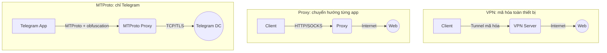

# Proxy, VPN và Hệ sinh thái MTProto

## Mở đầu

Mỗi gói tin bạn gửi đi đều đi qua nhiều mắt xích — router, ISP, các tuyến cáp, máy chủ đích. Trên đường đó: ISP biết bạn vào đâu, máy chủ đích biết IP của bạn, chính phủ có thể chặn tên miền, dịch vụ có thể từ chối phục vụ vì bạn ở "sai" quốc gia.

Ba họ công cụ giải quyết những bất tiện này: **proxy, VPN, CDN**. Chúng đều là "trung gian" nhưng phục vụ ba mục đích khác hẳn nhau.

---

## Phần 1. Ba khái niệm cốt lõi

- **Proxy** — người giao hàng hộ. Cửa hàng chỉ thấy người giao, không thấy bạn.
- **VPN** — đường hầm bọc thép. Toàn bộ lưu lượng thiết bị được niêm phong, không ai dọc đường nhìn được.
- **CDN** — kho hàng đặt khắp nơi. Hàng được gửi từ kho gần nhất, không phải từ nhà sản xuất ở đầu kia trái đất.

### Proxy

Máy chủ trung gian, nhận request rồi gửi tiếp. Ba dạng:

1. **Forward proxy** — cấu hình thủ công cho từng app. HTTP/HTTPS proxy cho trình duyệt; SOCKS5 proxy cho mọi TCP/UDP. HTTP proxy đọc được URL; HTTPS proxy chỉ tunnel qua `CONNECT`.
2. **Transparent proxy** — ISP/tổ chức đặt sẵn trên mạng, không cần cấu hình client. Dùng để lọc nội dung, cache. Không sửa request.
3. **Reverse proxy** — đứng *trước* máy chủ web. Cân bằng tải, bảo vệ origin, phục vụ cache. CDN chính là dạng này.

### VPN

Bọc **toàn bộ** lưu lượng thiết bị vào kênh mã hóa. Web, mail, app điện thoại đều đi qua tunnel rồi mới ra Internet từ máy chủ VPN. Cho cùng lúc ba thứ: ẩn IP, mã hóa chống nghe lén, bỏ chặn theo địa lý.

### CDN

Mạng reverse proxy phân tán toàn cầu (Cloudflare, Akamai). Cache nội dung tĩnh ở điểm gần người dùng. Giấu IP của *máy chủ*, không phải của bạn.

> **Tóm**: Proxy giấu *bạn* khỏi web. VPN giấu *bạn* khỏi cả ISP. CDN giấu *máy chủ* khỏi bạn.

---

## Phần 2. Proxy dân cư vs Datacenter

| Tiêu chí | Dân cư (Residential) | Datacenter |
|----------|---------------------|------------|
| Nguồn IP | ISP cấp cho hộ gia đình | Nhà cung cấp cloud |
| Mức "tự nhiên" | Trông như user thật | Dễ bị nghi |
| Khả năng bị block | Thấp | Cao |
| Tốc độ | Trung bình | Rất nhanh |
| Giá | Đắt (theo GB) | Rẻ (theo tháng/IP) |
| Dùng cho | Scraping nhạy cảm, ad verification | Tải nặng, chi phí thấp |

Trang web chống bot càng gắt thì càng phải dùng dân cư.

---

## Phần 3. Các giao thức VPN

### IPSec
Layer 3 — mã hóa cả gói IP. Tích hợp sẵn trong nhân OS, ổn định cho site-to-site và VPN doanh nghiệp (IPSec/L2TP). Cấu hình phức tạp (IKE handshake), khó qua NAT.

### OpenVPN
Chạy trên TLS, TCP hoặc UDP. Lâu đời, audit kỹ, đa nền tảng. Cân bằng tốt giữa tương thích và bảo mật. Nặng hơn WireGuard, cấu hình rườm hơn.

### WireGuard
Codebase ~4000 dòng, dùng Curve25519, ChaCha20, BLAKE2. Hiệu năng cao, kết nối lại tức thì khi đổi mạng. Chỉ chạy UDP — chặn UDP là đứt; mặc định không che giấu được mình là VPN.

### Cloudflare WARP (1.1.1.1)
VPN nửa vời. Mã hóa lưu lượng tới hạ tầng Cloudflare qua MASQUE (HTTP/3) rồi đẩy ra Internet. **Không** giấu IP, không chọn quốc gia, không bypass chặn địa lý. Chỉ ngăn ISP nghe trộm và tăng tốc qua mạng Cloudflare. Coi như "HTTPS cho mọi thứ".

---

## Phần 4. Bảng so sánh dịch vụ

| Dịch vụ | Loại | Giao thức | Ẩn danh | Định vị | Giá | Hợp với |
|---------|------|-----------|---------|---------|-----|---------|
| **Oxylabs** | Proxy DC + dân cư | HTTP/SOCKS5 | Cao | 195+ nước | Theo GB | Scraping, ad verification |
| **Proxy-Cheap** | Proxy DC + dân cư | HTTP/SOCKS5 | Cao | Theo ISP | Theo tháng | SEO, scraping vừa |
| **ZenMate** | VPN | OpenVPN, WireGuard | TB-Cao | 71+ nước | Thuê bao | WiFi an toàn, streaming |
| **FoxyProxy** | VPN + Proxy | HTTP/SOCKS5, OpenVPN | Trung bình | 110+ nước | Thuê bao | Streaming đa quốc gia |
| **Cloudflare WARP** | DNS + tunnel | DoH, DoT, MASQUE | Thấp | Không đổi | Free / WARP+ | Bảo mật WiFi công cộng |
| **VPN thương mại** (Express, Nord) | VPN | OpenVPN, WireGuard | TB-Cao | Hàng chục nước | Thuê bao | Riêng tư, bỏ chặn |

Cần ẩn IP → cột "Ẩn danh: Cao". Cần đổi quốc gia → cột "Định vị". Chỉ cần mã hóa → WARP miễn phí đủ.

---

## Phần 5. MTProto và Proxy của Telegram

Telegram không dùng TLS chuẩn. Họ tự thiết kế **MTProto** từ 2013 — toàn bộ stack mã hóa + transport thay TLS trong vai trò "ổ khóa cho mọi cuộc trò chuyện client-DC". Phần này bóc bản chất từng lớp để hiểu MTProto Proxy thực ra là biến thể nào.

### 5.1. Vì sao Telegram tự làm thay vì dùng TLS

- TLS handshake nặng (2-3 RTT), thiết kế cho web request-response, không tối ưu cho mobile messaging long-lived.
- TLS lộ SNI và certificate → DPI nhận diện ngay.
- Một số nước chặn chữ ký TLS đặc trưng → cần obfuscation tích hợp sẵn, không đặt ngoài.

MTProto trả lời cả ba: handshake một lần dùng mãi, message overhead thấp, có lớp obfuscation built-in.

### 5.2. Ba lớp độc lập

```
┌─────────────────────────────────┐
│  3. API / RPC (TL schema)       │  object ↔ binary
├─────────────────────────────────┤
│  2. Cryptographic               │  AES-256-IGE + auth_key
├─────────────────────────────────┤
│  1. Transport                   │  TCP/UDP/WS/HTTP + obfuscation
└─────────────────────────────────┘
```

Đổi transport không ảnh hưởng crypto, đổi crypto không ảnh hưởng API. Tách lớp này cho phép **MTProto Proxy chỉ can thiệp tầng 1** mà giữ nguyên tầng 2-3 — proxy không decrypt được, không thấy nội dung message, chỉ forward byte stream.

### 5.3. Tạo `auth_key` — RSA bootstrap + Diffie-Hellman

Lần đầu chạy app, client tạo `auth_key` 2048-bit dùng chung với server. Đây là khóa AES cho mọi message về sau. Quá trình 9 bước, rút gọn:

```
Client                                                    Server
  │                                                          │
  │── req_pq_multi(nonce) ──────────────────────────────────▶│
  │                                                          │
  │◀── resPQ(nonce, server_nonce, pq, RSA fingerprints) ─────│
  │                                                          │
  │  Factor pq = p × q  (pq ≤ 2^63, proof-of-work chống DoS) │
  │  Sinh new_nonce (256 bit)                                │
  │                                                          │
  │── req_DH_params(p, q, RSA-OAEP(server_pubkey, payload))─▶│
  │                                                          │
  │◀── server_DH_params_ok(AES-IGE(g, dh_prime, g_a)) ───────│
  │                                                          │
  │  Sinh b (2048 bit), compute g_b = g^b mod dh_prime       │
  │                                                          │
  │── set_client_DH_params(AES-IGE(g_b)) ───────────────────▶│
  │                                                          │
  │◀── dh_gen_ok ────────────────────────────────────────────│
  │                                                          │
  │  Cả hai compute  auth_key = g^(ab) mod dh_prime          │
  └──────────────────────────────────────────────────────────┘
```

Bản chất từng bước:

- **`pq` factorization** không bảo mật gì — chỉ là **proof-of-work nhẹ** chống spam. Server không tin client mới cho tới khi nó factor xong số nhỏ. Bot mở triệu connection/giây → CPU cost dập tắt.
- **RSA chỉ dùng một lần** để bảo vệ payload `new_nonce` + DH params trong `req_DH_params`. RSA **không** tham gia shared secret cuối — nếu khóa RSA private của Telegram lộ thì session quá khứ vẫn an toàn (đã có DH).
- **Diffie-Hellman 2048-bit** mới là bước tạo `auth_key`. Cả hai phía compute `g^(ab) mod p`; `a` và `b` không bao giờ qua dây → eavesdropper bắt full traffic vẫn không tính được auth_key.
- **Perfect Forward Secrecy không nằm ở auth_key chính** (auth_key dùng lâu dài, ràng với device). PFS bổ sung qua **temp_auth_key** có `expires_in`, bind vào auth_key chính qua `auth.bindTempAuthKey`. Vài giờ rotate một lần → lộ khóa hiện tại không giải mã được history.

So với TLS:
- TLS: 1-2 RTT mỗi session, ECDHE từng session → PFS mặc định.
- MTProto: 3-4 RTT chỉ lần đầu, DH 2048 cho long-term → PFS qua temp key tách biệt. Lợi: từ session thứ hai *không cần handshake lại* — resume bằng `auth_key_id`.

### 5.4. Mã hóa từng message — `msg_key` kép vai trò

Sau khi có auth_key, mỗi packet MTProto:

```
┌──────────────┬──────────────┬──────────────────────────────┐
│ auth_key_id  │   msg_key    │  encrypted_data (AES-IGE)    │
│   8 byte     │   16 byte    │       biến đổi               │
└──────────────┴──────────────┴──────────────────────────────┘
```

- **`auth_key_id`** = 64 bit thấp của `SHA1(auth_key)`. Server biết dùng auth_key nào để decrypt (1 client có nhiều auth_key cho nhiều DC).
- **`msg_key`** = **128 bit giữa** của `SHA256(32-byte-từ-auth_key || message_body)`.

`msg_key` đảm nhiệm **hai vai trò cùng lúc**:

1. **Integrity check (MAC)** — sửa byte nào trong body cũng đổi msg_key. Server decrypt → recompute msg_key → so sánh. Khác → drop.
2. **Nguồn cho IV và AES key** — `aes_key` và `aes_iv` derive từ `SHA256(msg_key || auth_key_slice)`. Mỗi message có IV unique mà không cần truyền IV riêng trên dây.

Cơ chế gọn hơn TLS (TLS truyền MAC + IV riêng), vẫn an toàn nếu SHA256 đủ mạnh. **AES-IGE** (Infinite Garble Extension) thay CBC vì lan truyền lỗi xa hơn → sửa 1 byte cipher → toàn bộ block sau đều hỏng → tampering không che được.

### 5.5. Transport — chỗ proxy can thiệp

MTProto định nghĩa 4 wire format raw + 1 lớp obfuscation:

| Variant | Marker đầu | Overhead | Ghi chú |
|---------|-----------|----------|---------|
| **Abridged** | `0xef` | 1-4 byte | Nhẹ nhất, length / 4 |
| **Intermediate** | `0xeeeeeeee` | 4 byte | Length 4-byte little-endian |
| **Padded intermediate** | `0xdddddddd` | 4-19 byte | Cộng 0-15 byte padding ngẫu nhiên (chống fingerprint theo size) |
| **Full** | (none) | 12 byte | Có sequence number + CRC32 |
| **Obfuscated2** | (64 byte random) | 64 byte init | Bọc một trong các variant trên bằng AES-CTR |

Variant 1-4 là **raw** — DPI nhìn 4 byte đầu là phát hiện MTProto. Variant 5 là chỗ MTProto Proxy thực sự sống.

### 5.6. Obfuscated2 — bản chất MTProto Proxy

Bản chất một câu: **bọc toàn bộ MTProto stream trong AES-256-CTR với khóa derive từ 64 byte ngẫu nhiên ban đầu, có secret tham gia KDF**.

**Init packet 64 byte** client tạo ngẫu nhiên với constraint chống va chạm:

- Byte 0-55: random thuần.
- Byte 56-59: identifier transport bên trong (abridged / intermediate / padded / full).
- Byte 60-63: DC ID (cho MTProxy biết route tới data center nào, signed 16-bit LE; media DC âm).
- Byte 0 ≠ `0xef` (không trùng abridged marker).
- 4 byte đầu ≠ `0xdddddddd`, `0xeeeeeeee`, `POST`, `GET`, `HEAD` (không trùng raw variant hoặc HTTP).
- Byte 4-8 ≠ `0x00000000` (không trùng Full transport).

Constraint đảm bảo init packet không bị nhầm với một variant raw hoặc HTTP request. Server đọc 4 byte đầu → biết phải xử lý theo Obfuscated2.

**Derive khóa**:

```
encryption_key = init[8..40]              # AES-256 key cho client → server
encryption_iv  = init[40..56]             # IV cho cùng chiều
decryption_key = REVERSED(init)[8..40]    # AES-256 key cho server → client
decryption_iv  = REVERSED(init)[40..56]
```

Đảo ngược 64 byte để có cặp khóa thứ hai — encryption stream và decryption stream độc lập, dù cùng nguồn entropy.

**Chỗ secret can thiệp** (chỉ với MTProxy, không phải MTProto chuẩn):

```
encryption_key = SHA256(encryption_key || secret)
decryption_key = SHA256(decryption_key || secret)
```

Secret 16 byte **không truyền qua dây**. Nó chỉ tham gia KDF tại cả hai phía. Hệ quả:

- Client biết secret → derive cùng cặp key như server → byte 56-59 sau decrypt là identifier hợp lệ → server tiếp tục stream.
- Client **sai secret** → key sai → byte 56-59 ra rác → server **đóng connection im lặng**, không trả lỗi, không gửi gì.

Đây là chìa khóa **kháng active probing**:

- Trung Quốc probe IP nghi vấn bằng cách tự kết nối thử với traffic giả → tìm chữ ký phản hồi đặc trưng (vd. ServerHello của Shadowsocks) → ban.
- MTProto Proxy: probe không có secret → server im → không có chữ ký để nhận diện → không có cớ ban.
- So với Shadowsocks: SS server cũng kiểm tra password nhưng phản hồi (đóng RST hay buffer) đủ đặc trưng để fingerprint. MTProto Proxy chỉ silently drop → indistinguishable với cổng đóng.

Sau init packet, **toàn bộ stream** đi qua AES-CTR cùng cặp key → trên dây là byte ngẫu nhiên đều. Bên trong CTR là một MTProto raw variant đã giấu.

### 5.7. FakeTLS — lớp ngụy trang ngoài cùng (MTProxy v2)

Từ 2019, MTProto Proxy thêm chế độ **FakeTLS**: bao Obfuscated2 trong handshake giả lập TLS 1.3.

- Client gửi ClientHello giả, SNI là domain thật (`www.google.com` chẳng hạn).
- Server đáp ServerHello giả khớp luật TLS 1.3.
- Sau handshake giả → MTProto traffic chạy trong "TLS application data" record.

Từ DPI: trông y hệt HTTPS đến Google. Cipher suite, extension, timing đều khớp. Để phân biệt, kiểm duyệt phải MITM (decrypt mới biết bên trong là MTProto, không phải HTTP) — đắt và dễ false positive khi gặp traffic Google thật.

Cơ chế secret encode: `ee` + `<16-byte-secret>` + `<utf8-domain>`. Client parse ra → biết giả TLS với domain nào.

### 5.8. So sánh với proxy khác

| | SOCKS5 | HTTP Proxy | OpenVPN/WireGuard | MTProto Proxy |
|--|--------|-----------|-------------------|---------------|
| Tầng can thiệp | TCP/UDP relay | HTTP/S relay | Toàn IP | Transport MTProto |
| Mã hóa | Không | Không (HTTPS có) | Toàn thiết bị | Có sẵn ở tầng 2 MTProto |
| Phạm vi | Mọi TCP/UDP | Chỉ HTTP/S | Mọi gói tin | Chỉ Telegram |
| Auth | User/pass | Basic | Cert/PSK | Secret 16 byte qua KDF |
| Phản hồi khi sai auth | Có lỗi | Có lỗi | Có lỗi | **Im lặng** |
| Khó bị DPI | TB | TB | Thấp | Rất cao (Obfuscated2) → cực cao (FakeTLS) |
| Cấu hình | Đơn giản | Đơn giản | Phức tạp | Dán link `tg://` hoặc `https://t.me/proxy?...` |
| Băng thông tiêu thụ | Tùy | Tùy | Cao (overhead VPN) | Rất thấp (vài chục MB/năm cho text) |

### 5.9. Ưu nhược

**Ưu**:
- Handshake một lần dùng mãi → latency thấp.
- Obfuscated2 + FakeTLS → kháng DPI và active probing đồng thời.
- Tách lớp transport → proxy operator không thấy nội dung message (đã encrypt ở tầng 2 trước khi vào proxy).
- Mobile-friendly: chuyển WiFi ↔ LTE liền mạch nhờ message ID + seq trong session.

**Nhược**:
- Chỉ bảo vệ Telegram. Web, mail, app khác vẫn lộ.
- IP server proxy vẫn có thể bị block thủ công nếu chính phủ đầu tư resource đủ.
- FakeTLS chỉ giả ClientHello/ServerHello — kiểm duyệt MITM toàn bộ TLS thì vẫn lộ (đắt nhưng làm được).
- MTProto là protocol custom — giới crypto từng lo ngại AES-IGE ít được audit hơn AES-GCM. Telegram đáp lại bằng cuộc thi crack public 2013-2014 (không ai phá được auth_key trong thực tế).

---

## Phần 6. Vấn đề thực tế khi triển khai

### 6.1. Bypass tường lửa và DPI

Trung Quốc, Iran, Nga dùng Deep Packet Inspection để soi chữ ký giao thức. OpenVPN, WireGuard, Tor đều có dấu vân tay riêng. Cách chống:

- **Obfuscation**: bọc giao thức gốc trong vỏ "trông như HTTPS" (obfs4, Shadowsocks, V2Ray/VLESS, MTProto).
- **Domain fronting**: gửi tới CDN lớn, SNI nói tên A nhưng Host header nói tên B.
- **MASQUE / HTTP/3**: chôn lưu lượng trong QUIC, khó phân biệt với traffic web.

NDSS 2023 chỉ ra Shadowsocks và obfs4 vẫn lộ đặc điểm timing và size TCP — phát hiện được chỉ với vài gói probe. **Không dựa vào một lớp che giấu duy nhất**, chồng nhiều tầng (TLS 1.3 + domain fronting + tunnel CDN).

### 6.2. Bị block IP

Trang web phát hiện proxy → blacklist, rate-limit, CAPTCHA. Đối phó:

- **Rotating proxies**: pool nghìn-triệu IP, mỗi request một IP.
- **Proxy dân cư**: ít bị nghi.
- **Multi-hop**: chuỗi 2-3 proxy nối tiếp.
- **Rate limit phía client**: chậm lại để dấu chân giống user thật.

### 6.3. Bảo mật trong tổ chức

Doanh nghiệp dùng VPN/proxy với tư duy ngược — bảo vệ nội bộ, không phải vượt rào.

- **Site-to-site VPN** (IPSec): nối các văn phòng thành LAN duy nhất.
- **Remote access VPN** (OpenVPN, WireGuard, IPSec/IKEv2): nhân viên từ xa truy cập tài nguyên nội bộ.
- **Forward proxy nội bộ**: kiểm soát duyệt web, lọc nội dung, cache, log.
- **Split-tunnel** (chỉ traffic công ty) vs **full-tunnel** (toàn bộ).

PKI nội bộ hoặc WireGuard keys + MFA/OTP/chứng chỉ máy là bắt buộc. Log chỉ giữ metadata (thời gian, dung lượng, IP), không phân tích nội dung.

### 6.4. Hạ tầng và kỹ thuật

- **Phần cứng**: server có CPU AES-NI, NIC ≥1Gbps, dải IP đa địa lý.
- **OS tuning**: `net.core.somaxconn`, mở giới hạn fd, bật BBR cho TCP.
- **Tự động hóa**: Terraform/Ansible đa datacenter, container hóa.
- **Giám sát**: Prometheus + Grafana cho connections/sec, throughput, packet loss, latency. Alert khi proxy bị block.
- **Chứng chỉ TLS**: tự động qua Let's Encrypt.
- **Anti-detect**: stack browser fingerprint (Canvas, WebGL, fonts) khi cần giả lập trình duyệt thật.

Metric phải theo dõi: tỷ lệ connect thành công, p95/p99 latency, throughput per node, số probe nghi vấn, tuổi thọ trung bình của một IP trước khi bị block.

### 6.5. Pháp lý

- **Mỹ, EU, Nhật, hầu hết Đông Nam Á**: VPN/proxy hợp pháp.
- **Trung Quốc, UAE, Nga**: VPN không cấp phép là vi phạm; người dùng có thể bị phạt hành chính.
- **Iran, Triều Tiên**: có thể bị truy cứu hình sự.

Việt Nam không cấm VPN cá nhân, nhưng dùng để truy cập dịch vụ bị chặn (Telegram theo nghị định mới) có thể vướng quy định nội dung và an ninh mạng. Tham vấn luật địa phương trước khi triển khai dịch vụ thương mại.

---

## Phần 7. Lưu đồ



VPN bọc toàn thiết bị. Proxy chỉ định tuyến app được cấu hình. MTProto Proxy chỉ Telegram, mã hóa và ngụy trang sâu.

---

## Phần 8. Khuyến nghị triển khai

1. **Xác định mô hình đe dọa trước**. ISP nghe trộm, chính phủ chặn, hay web target ban IP? Mỗi đối thủ cần giải pháp khác.
2. **Chọn giao thức**:
   - Che IP trên web → proxy dân cư xoay vòng.
   - Bảo mật toàn thiết bị → WireGuard.
   - Vượt DPI gắt → MTProto / Shadowsocks / V2Ray + TLS.
   - Kết nối doanh nghiệp → IPSec hoặc WireGuard có PKI.
3. **Giám sát từ ngày đầu**: Prometheus/Grafana, alert khi node block, latency tăng, cert sắp hết hạn.
4. **Chống chặn nhiều lớp**: rotate IP, multi-hop, obfuscation, domain fronting.
5. **Bảo mật**: log tối thiểu, cập nhật phần mềm, MFA cho admin, least privilege.
6. **Dự phòng**: nhiều nhà cung cấp IP, nhiều region, sẵn sàng quay vòng.

---

## Kết luận

- Ẩn danh khi scrape → proxy dân cư.
- WiFi quán cà phê → WARP hoặc VPN thương mại.
- Bypass kiểm duyệt gắt → Shadowsocks / V2Ray / MTProto + obfuscation nhiều lớp.
- Doanh nghiệp → WireGuard hoặc IPSec có PKI.
- Bảo vệ máy chủ khỏi DDoS → CDN/reverse proxy như Cloudflare.
---

## Phần 9. Case study: Tối ưu latency cho Static Proxy Gateway

Một lát cắt cụ thể của Phần 6: giảm latency cho API gateway đặt giữa client và các upstream API bị giới hạn theo IP.

### 9.1. Bối cảnh

Tích hợp với third-party API (Hyperliquid, Binance, các nhà cung cấp dữ liệu blockchain) thường vướng ba rào cản:

1. **Rate limit per-IP**: Hyperliquid cho 600 req/phút = 10 rps mỗi IP. Backend chỉ có 1 IP công cộng → trần 10 rps, dù business cần 50.
2. **Lỗi tạm thời**: timeout, 5xx, 429 lan vào hệ thống → cascading failure.
3. **Response lặp lại**: cùng query lặp nhiều lần trong vài giây → nên cache.

Lời giải: **resilient proxy gateway** đứng giữa client và upstream, gánh circuit breaker, cache Redis, forward qua pool proxy IP.

### 9.2. Hai mô hình proxy thương mại: Rotating Gateway vs Static IPs

Trước khi đi vào chi tiết kỹ thuật, phân biệt hai mô hình proxy — đây là quyết định kiến trúc gốc rễ ảnh hưởng tới mọi tầng tối ưu phía sau.

#### Static (Dedicated) IPs

Provider: Webshare static, Oxylabs ISP, residential dedicated.

Client nhận **danh sách N IP cố định** (10–500 IP), mỗi IP là endpoint trực tiếp với host:port riêng.

- Pool hữu hạn, chỉ tài khoản này dùng.
- Tự quản lý: chọn IP nào cho request nào, monitor health, xoay khi cần.

Bản chất provider không *sở hữu* IP. Họ **thuê thiết bị thật của người khác** rồi biến thiết bị đó thành điểm thoát. IP của exit chính là IP mà ISP cấp cho thiết bị đó — trùng dải IP với hàng xóm cùng ISP, nên target nhìn vào không phân biệt được.

##### Lấy từ đâu ? 

| Nguồn | User exit có biết? | Cài gì | Hợp đồng | Provider tiêu biểu |
|-------|---------------------|--------|----------|---------------------|
| **SDK nhúng app free** | Thường không | App "VPN free", utility, downloader có nhúng SDK | EULA dài, dòng cho phép làm exit node viết mờ | Bright Data (cũ Luminati), Oxylabs |
| **P2P trả tiền opt-in** | Có, minh bạch | Honeygain, EarnApp, IPRoyal Pawns, PacketStream | Terms rõ, dashboard earn $0.10-0.40/GB | IPRoyal, Bright Data, nhiều |
| **ISP partnership** | Không biết | Không cài gì client-side | ISP và provider thoả thuận, mix vào dải IP | Một số provider tier-1 |
| **Mobile SIM farm** | Không có user cuối | Provider tự build hardware (modem 4G + SIM) | Provider sở hữu SIM, vận hành như datacenter ngụy trang | SOAX, Bright Data mobile, IPRoyal mobile |

Case kinh điển: **Hola VPN scandal 2015** — user dùng Hola VPN free, không biết máy mình bị bán làm exit cho công ty Luminati (tên cũ của Bright Data). Toàn bộ residential network của Luminati thời đó đến từ user Hola.

##### Cơ chế: tại sao gói tin "có quyền" đi qua máy nhà dân

Không có gì là "có quyền" hay "phá firewall". Thiết bị nhà dân **chủ động relay** vì có process do user đã cài đang chạy:

```
[Provider control plane (US)]
       ▲ giữ outbound long-lived
       │ (giống Discord/Steam giữ kết nối server)
       │
[SDK chạy trên PC/mobile nhà dân]
       │
       │ Khi có job đến từ control plane:
       │   1. SDK mở TCP outbound đến target.com
       │   2. ISP nhà dân thấy: máy user gửi request bình thường
       │   3. target.com thấy: IP nhà dân ABC.xx.yy.zz đang request
       │   4. SDK đọc response → gửi ngược control plane
       │   5. Control plane trả response cho khách (gateway của bạn)
       ▼
[target.com]
```

Ba điểm cốt lõi:

1. SDK giữ **outbound** connection đến control plane → không cần public IP, không cần port forward, không cần phá NAT. Y hệt cách app messenger duy trì kết nối.
2. Khi relay, SDK mở **connection mới** từ máy nhà dân đến target — *từ góc nhìn ISP và target, không phân biệt được với traffic user thường*.
3. Provider **không tiêm gói** vào máy. SDK là kẻ chủ động gửi, đang chạy với quyền user, hợp pháp về mặt OS.

##### Muốn tự dùng IP của mình?
**Cài đặt tối thiểu** (5 phút, Linux):
```bash
sudo apt install squid
sudo htpasswd -c /etc/squid/passwd youruser
# /etc/squid/squid.conf:
#   auth_param basic program /usr/lib/squid/basic_ncsa_auth /etc/squid/passwd
#   acl authenticated proxy_auth REQUIRED
#   http_access allow authenticated
#   http_port 3128
sudo systemctl restart squid

# Test từ ngoài:
curl -x http://youruser:pass@<your_home_ip>:3128 https://api.target.com
```

Alternative: `3proxy`, `dante` (SOCKS5), `tinyproxy`, `gost` (multi-protocol).

**Sáu rào cản thực tế** (CGNAT là rào lớn nhất ở VN):

| Rào | Vấn đề | Workaround |
|-----|--------|------------|
| **IP động** | ISP gia đình đổi IP mỗi vài giờ/ngày → URL hôm nay khác hôm mai | Dynamic DNS (DuckDNS, No-IP), nhưng IP vẫn rotate |
| **CGNAT** | Viettel mobile, một số VNPT FTTH gói rẻ → bạn share IP với 100 user khác, không có public IP, port forward chết | Reverse tunnel qua VPS (mất tính residential), hoặc gọi ISP xin gói có public IP |
| **TOS ISP cấm chạy server** | FPT/VNPT/Viettel home đều cấm chạy server thương mại trong hợp đồng | Nâng gói business → tốn ~5-10× tiền |
| **Port block** | ISP block 25/80/443 inbound chống user host web | Dùng port lạ (3128, 8080, 1080) — vẫn có thể bị block bất ngờ |
| **Upload yếu** | Gói gia đình up << down (vd 100/20 Mbps) → proxy bottleneck là upload | Không workaround thực sự, chỉ nâng gói |
| **Bảo mật** | Mở proxy public = mời botnet scan, auth yếu = bị abuse → ISP ban IP do gửi spam/attack | Auth mạnh + rate limit + IP whitelist + monitor log |


##### Topology thực tế của 1 request

```
[OpenResty gateway]   ──TCP/TLS──►   [Provider super-proxy]
   ở VN/SG                              ở US/EU
                                              │ internal routing
                                              │ (provider chọn exit theo username)
                                              ▼
                                   [Exit node = static residential IP]
                                   PC nhà dân US, mobile SIM,...
                                              │
                                              │ Internet thường
                                              ▼
                                       [Upstream API Hyperliquid Tokyo]
```

Mỗi mũi tên = TCP connection riêng. Chỉ leg đầu (gateway ↔ super-proxy) là client của bạn cầm trực tiếp; các leg sau provider quản, bạn không thấy được.

#### Rotating Gateway

Provider: Bright Data, Oxylabs Rotating, Smartproxy, Webshare rotating endpoint.

Client kết nối đến **một endpoint duy nhất** (ví dụ `gateway.smartproxy.com:7000`). Mỗi TCP connection được provider gán một exit IP ngẫu nhiên từ pool hàng triệu IP.

- Pool 10M+ IP dân cư, rate limit per-IP của upstream gần như vô hiệu.
- Không cần quản lý IP. Provider lo block, rotation, geolocation.

#### Vì sao Rotating Gateway latency cao và không ổn định

Đường thực tế của một request:

```
client → rotating gateway → internal load balancer → exit node → upstream
```

Mỗi request phải:

1. TCP handshake đến gateway (1 RTT).
2. Authenticate.
3. **Internal routing**: gateway → LB → assign exit IP. Phần che giấu — có thể qua nhiều hop nội bộ tùy infra provider.
4. TCP/TLS handshake từ exit node đến upstream.
5. Response trả về đúng đường đó.

Hai nguồn latency cộng dồn không kiểm soát được:

- **Internal hop variance**: provider có thể route exit qua datacenter khác để cân bằng tải hoặc né IP đã bị block. Mỗi request đi qua infrastructure khác nhau → p50 ổn nhưng p95/p99 nhảy.
- **Cold path mỗi rotation**: exit IP đổi liên tục, upstream thấy mỗi request là client mới → không TLS resume, không HTTP keepalive. Pool client-side cũng vô dụng — pool key gateway giống nhau nhưng exit IP đổi → connection idle có thể đang bám exit cũ đã bị xoay vòng, dùng lại sai context.

Với traffic độ trễ nhạy (trading API, real-time data, payment), variance này không chấp nhận được.

#### Vì sao Static IPs mở khóa tối ưu sâu hơn

- **Pool key đoán được**: `(static_ip, port, proxy_opts, ssl)` cố định → connection pooling work thật.
- **TLS với upstream resume được**: cùng IP → session ticket valid → tiết kiệm 1 RTT.
- **Debug được**: mỗi IP monitor riêng. IP nào 429 nhiều, latency cao, bị ban → biết mà loại khỏi pool.
- **Strategy tùy chỉnh**: round-robin cho IP utilization, sticky cho pool warmth, subset cho balance — quyết định ở phía bạn, không phụ thuộc provider.

Đánh đổi: pool nhỏ hơn nhiều. Budget = N × rps/IP, không còn "vô hạn". Vượt budget thì scale ngang (mua thêm IP) chứ không tự động như rotating.

#### Lựa chọn

- **Rotating gateway** hợp với: scraping khối lượng lớn, latency không nhạy, traffic batch trải đều, không cần debug per-IP. Ví dụ: crawl SEO data, price monitoring nightly, dataset enrichment.
- **Static IPs + tự build rotation layer** hợp với: API tích hợp real-time, traffic nhạy latency, cần predictable variance, cần observability per-IP. Ví dụ: trading bot, payment gateway, data feed cho dashboard.

Dự án thuộc nhóm thứ hai → static IPs + OpenResty layer tự rotate. Tóm gọn: **rotating đánh đổi latency và observability lấy pool size; static đánh đổi pool size lấy kiểm soát latency**.

### 9.3. Kiến trúc

```
client  →  OpenResty (Lua)  →  static proxy IP  →  upstream API (TLS)
            │
            ├── Circuit breaker (per API)
            ├── Redis cache (per query)
            ├── Retry với exponential backoff
            └── Proxy strategy (chọn IP nào)
```

Gateway nhận request, kiểm tra circuit breaker, kiểm tra cache, miss thì đẩy qua một proxy trong pool (`PROXY_URLS` chứa danh sách rotate), proxy forward đến upstream qua HTTP `CONNECT` tunnel + TLS end-to-end. Trên đường về, response cache, circuit breaker ghi success, stats log.

#### Vì sao OpenResty (nginx + Lua) thay vì Node.js?

**1. Connection pool là tính năng built-in, không phải code thêm.**
nginx có `keepalive` upstream block + `lua_socket_pool_size` từ thiết kế gốc. lua-resty-http reuse pool tự động qua `set_keepalive()`. Node.js: `http.Agent` có pool nhưng pool **per-process**, cluster N workers = N pool tách biệt → hit rate giảm 1/N. Để share pool giữa workers Node phải tự build (proxy nội bộ + IPC).

**2. Shared state giữa workers qua `lua_shared_dict` — zero IPC.**
Circuit breaker state, rate limit counter, proxy health stats sống trong **shared memory** (mmap) đọc/ghi atomically từ mọi worker. Hot path không đụng Redis. Node cluster: workers cô lập, muốn share state → Redis hoặc IPC → +1 RTT mỗi request hoặc latency lock.

**3. Performance per-connection ăn đứt cho I/O-bound proxy workload.**

| Metric | OpenResty | Node.js |
|--------|-----------|---------|
| Memory / worker | ~10-30 MB | ~80-150 MB (V8 baseline) |
| Concurrent conn / worker | 10-50k | 5-10k |
| GC pause | LuaJIT incremental, sub-ms | V8 STW có thể 10-100 ms |
| TLS / proxy code path | C native | JS qua libuv |
| `nginx -s reload` | Zero-downtime | PM2 cluster restart từng worker |

GC pause Node là sát thủ ẩn cho gateway latency-sensitive: p99 jump 50-100 ms không lý do.

**4. Phase model nginx phù hợp cấu trúc proxy.**

```
access_by_lua_block   → check rate limit, circuit breaker, auth
content_by_lua_block  → chọn proxy, gọi httpc, return response
log_by_lua_block      → ghi stats async, không block response
```

Mỗi phase chạy đúng lúc, log_phase chạy **sau khi** response đã gửi → log không cộng vào TTFB. Node middleware: tất cả chạy trong cùng request handler, log đồng bộ cộng vào latency trừ khi tự fork promise.

##### Kết luận

Workload = **CPU < 5%, network I/O 100%, latency-sensitive, cần shared state cho circuit breaker + rate limit**. Đây là sweet spot của nginx/OpenResty. Node làm được nhưng phải tự rebuild pool + state sharing → reinvent thứ nginx có sẵn 20 năm. Vẫn dùng Node ở các service downstream cần ORM, business logic — nhưng **edge proxy luôn là nginx**.

Quota giải xong nhưng phát sinh vấn đề mới: **latency**.

### 9.4. Vấn đề: Handshake giết latency

Request trực tiếp chỉ cần 1 RTT TCP + 1-2 RTT TLS. Chèn hop proxy thì:

| Bước | Chi phí |
|------|---------|
| TCP handshake gateway ↔ Proxy | 1 RTT |
| `CONNECT` tunnel setup | 1 RTT |
| TLS handshake end-to-end với upstream | 1-2 RTT (TLS 1.3) hoặc 2 RTT (TLS 1.2) |
| HTTP request thực sự | 1 RTT |

**4-5 RTT bắt tay** trước khi byte data đầu tiên gửi đi. Proxy ở Mỹ + upstream ở Singapore, mỗi RTT ~150ms → **600-750ms latency thuần handshake** mỗi request. Hàng trăm rps là thảm họa.

> **Mục tiêu**: tái sử dụng connection TCP + TLS tunnel tới proxy giữa các request liên tiếp → bỏ handshake từ request thứ 2 → còn 1 RTT của HTTP gốc.

Bài toán **connection pooling** ở tầng client-side.

#### Bằng chứng đo lường

Bóc tách thời gian từng giai đoạn của một request thật bằng `curl -w`:

```bash
cat > curl-fmt.txt <<'EOF'
time_namelookup:    %{time_namelookup}s
time_connect:       %{time_connect}s         # TCP đến proxy
time_appconnect:    %{time_appconnect}s      # CONNECT + TLS đến upstream qua tunnel
time_starttransfer: %{time_starttransfer}s   # byte đầu response
time_total:         %{time_total}s
EOF

curl -w "@curl-fmt.txt" -o /dev/null -s \
     -x "http://USER:PASS@<static_ip>:8080" \
     "https://api.hyperliquid.xyz/info"
```

Đo trên client VN, proxy static IP ở US, upstream Hyperliquid (Tokyo):

| Giai đoạn | Cold (không pool) | Warm (pool reuse) |
|-----------|-------------------|-------------------|
| `time_namelookup` | 0.025s | 0.000s |
| `time_connect` (TCP đến proxy) | 0.190s | 0.000s |
| `time_appconnect` (CONNECT + TLS qua tunnel) | 0.640s | 0.000s |
| `time_starttransfer` | 0.910s | 0.270s |
| **`time_total`** | **0.940s** | **0.280s** |


- **`time_appconnect − time_connect ≈ 450ms`** là chi phí thuần CONNECT exchange + TLS handshake end-to-end với upstream qua tunnel. **Gần một nửa request total time** mà 100% biến mất khi connection được reuse từ pool.
- **`time_connect ≈ 190ms`** chỉ là TCP đến proxy. Từ request thứ 2 nếu pool work → 0ms.

Đối chứng với gọi trực tiếp không proxy (cùng client → upstream):

| Giai đoạn | Direct (không proxy) | Qua proxy cold | Hop proxy cộng thêm |
|-----------|---------------------|----------------|---------------------|
| `time_connect` | 0.080s | 0.190s | +110ms |
| `time_appconnect` | 0.180s | 0.640s | +460ms |
| **`time_total`** | **0.310s** | **0.940s** | **+630ms** |

Hop proxy cold cộng thêm ~630ms baseline mỗi request — gấp ba lần latency direct. **Pool work** kéo request qua proxy về 280ms — thậm chí **thấp hơn direct cold** vì TLS với upstream đã resume từ session ticket trong pool.

`tcpdump` xác nhận đối xứng:

```bash
tcpdump -i any 'tcp[tcpflags] & tcp-syn != 0' and host <proxy_ip>
```

- **Không pool**: ratio SYN/req ≈ 1:1 — mỗi request một TCP connection mới.
- **Pool work với `subset(3)` ở 24 rps**: ratio ≈ 1:8 — mỗi connection phục vụ ~8 request trước khi expire khỏi `keepalive_timeout`.

Số liệu trên trả lời câu hỏi gốc: **TLS handshake giữa proxy và static IP đến upstream chiếm ~450ms cứng mỗi request nếu đi trực tiếp không pool** — đó là khoản tiết kiệm chính của toàn bộ thiết kế ở các phần sau.

### 9.5. Giải pháp tầng 1: Connection Pooling đúng granularity

Pool connection hash theo tuple `(host, port, proxy_opts, ssl)` — gọi là **pool key**. Cùng pool key thì reuse được connection vật lý; khác key thì không.

Hai tham số quyết định:

- **`keepalive_timeout`** — connection idle giữ trong pool bao lâu. Quá ngắn → expire trước request kế. Quá dài → proxy/firewall đóng phía họ, gateway phát hiện khi đã gửi gói kế.
- **`keepalive_pool`** — số idle conn tối đa per pool key. Phải đủ chứa peak concurrency trên một proxy.

Thêm global cap per worker để tổng connection pooled không nổ ngoài kiểm soát khi nhiều API/proxy chạy song song.

Pool đúng kỹ thuật mới giải nửa bài toán. Còn lại: **chiến lược chọn proxy** quyết định pool key nào được hit lại.

### 9.6. Giải pháp tầng 2: Proxy Selection Strategy

Cân bằng hai tham số đối nghịch:

- **Pool hit rate** cao → ít proxy được dùng (request dồn vào cùng pool key).
- **IP utilization** cho rate limit budget đều → nhiều proxy được dùng (chia tải).

Round-robin thuần tối ưu IP utilization nhưng phá pool hit: với N proxy và M rps tổng, mỗi pool key chỉ nhận M/N rps → idle time vượt `keepalive_timeout` → connection expire trước khi reuse. Pool tồn tại nhưng không bao giờ được dùng.

#### `sticky` — hash-based selection

`proxy = proxies[hash(key) % N]` với key là client IP, header, hoặc api name.

- Cùng client → cùng proxy → cùng pool key. Pool hit gần 100% cho traffic ổn định.
- **Trade-off**: 1 client = 1 IP → rate limit per-IP dễ đập. Trên 429, retry tự fallback round-robin để thoát.
- Phù hợp: per-client traffic thấp hơn nhiều so với rate limit per-IP của upstream.
- **Tránh** key cardinality thấp (`api_name` đơn lẻ) — collapse toàn bộ traffic vào một proxy. Ưu tiên `client_ip` hoặc header user-scoped.

#### `subset` — active window

Round-robin trong N proxy đầu (default 3) thay vì cả pool. Mỗi pool key nhận M/3 rps → idle time giảm → pool hit cao.

Trên 429, **window trượt** một bước: proxy bị limit out, proxy mới in. Tự cách ly proxy "nóng" mà không cần config.

Phù hợp: traffic vừa phải, balance giữa pool warmth và rate limit headroom. Default an toàn cho hầu hết case.

### 9.7. So sánh strategy

| Strategy | Pool hit | IP utilization | 429 risk | Phù hợp |
|----------|----------|----------------|----------|---------|
| `round_robin` | Thấp | Tốt nhất | Thấp nhất | Traffic rất cao, cần budget tối đa |
| `sticky` | Cao nhất | Tệ (1 client = 1 IP) | Cao cho hot client | Per-client traffic nhỏ |
| `subset` | TB-Cao | Trung bình | TB, có swap | **Default an toàn** |
| `on_rate_limit` | N/A | N/A | N/A | Chỉ proxy khi nhận 429 |
| `never` | N/A | N/A | N/A | Local/internal API |

### 9.8. Case Hyperliquid (10 rps per IP)

- **`round_robin`** với N proxy → aggregate ≈ N × 10 rps. Budget tối đa, pool hit ~ 0.
- **`sticky` by `client_ip`** → 1 client max 10 rps. Trên 10 rps/client → 429 liên tục dù aggregate còn dư.
- **`subset(3)`** → 3 proxy active = 30 rps aggregate. Pool warm cho 3 host. 429 ở 1 proxy → window slide.

Production chọn `subset(3)`: pool warmth (3 pool key hit lặp lại) + headroom 30 rps (gấp 3 baseline).

### 9.9. Verify

1. **`tcpdump` đếm SYN**:
   ```bash
   tcpdump -i any 'tcp[tcpflags] & tcp-syn != 0' and host <proxy_ip>
   ```
   Pool work → SYN giảm mạnh so với số request. Lý tưởng SYN/req → 1/N với N là số request liên tiếp đi cùng proxy trong một keepalive window.
2. **Connection reuse log** từ HTTP client.
3. **Bench p95/p99** trước/sau bật pooling. Tail latency lộ rõ chi phí handshake — p95/p99 giảm mạnh hơn p50.

### 9.10. Tunables

| Param | Default | Ý nghĩa |
|-------|---------|---------|
| `keepalive_timeout` | 60000 ms | Idle 60s trong pool trước khi đóng |
| `keepalive_pool` | 50 | Max idle conn per `(host, port, proxy)` key |
| `lua_socket_pool_size` | 100 | Global cap per worker |
| `lua_socket_keepalive_timeout` | 60s | Global default keepalive |
| `proxy_subset_size` | 3 | Số proxy active trong window |

- Concurrent per proxy cao → tăng `keepalive_pool`.
- Burst với khoảng cách lớn → tăng `keepalive_timeout`, để ý proxy/firewall đóng phía họ.
- Aggregate vượt N × 10 rps → tăng `proxy_subset_size` (mỗi +1 = +10 rps headroom, đánh đổi pool hit).
- Per-client traffic dominate (>10 rps/client) → strategy không cứu được; cần app-level throttle.

### 9.11. Kết luận

1. **Chọn mô hình provider trước khi chọn strategy.** Rotating gateway khóa luôn cơ hội tối ưu — pool key opaque, exit IP đổi liên tục, TLS resume bất khả. Static IPs là điều kiện cần để mọi tối ưu phía sau có ý nghĩa.
2. **Tối ưu single-layer không đủ.** Pool đúng kỹ thuật mới giải nửa vấn đề — phải đổi cả selection strategy ở tầng business logic.
3. **Pool warmth và rate limit budget đối nghịch.** Không có giải pháp tốt nhất tuyệt đối, chỉ có giải pháp phù hợp với phân phối traffic cụ thể.
4. **Pool hit phụ thuộc pool key.** Round-robin xé pool key → idle time vượt timeout → pool vô dụng. Hash-based hoặc subset gom pool key lại.
5. **Đo trước khi tune.** `tcpdump` đếm SYN định lượng pool hit đơn giản. p95/p99 quan trọng hơn p50 — handshake overhead lộ ở tail.
6. Rotate IP, multi-hop, monitoring (Phần 6) chỉ phát huy khi tầng connection pool đúng. Pool proxy đẹp mà mỗi request ăn lại 4-5 RTT thì rate limit budget không cứu nổi latency.

Luận điểm xuyên suốt: **proxy/VPN không chỉ là chuyện chọn giao thức — chi phí thực tế nằm ở handshake, pool, chiến lược định tuyến**. Thiết kế tốt tối ưu từ tầng giao thức xuống tầng vận hành.

---


## Nguồn tham khảo

- Telegram MTProto specification (core.telegram.org/mtproto)
- Cloudflare WARP / 1.1.1.1 documentation
- NDSS 2023 — fingerprint của proxy chống DPI
- Tài liệu thương mại: Oxylabs, Proxy-Cheap, ZenMate, FoxyProxy
- RFC 7857 (NAT), RFC 8446 (TLS 1.3), RFC 9000 (QUIC), RFC 9298 (MASQUE)
