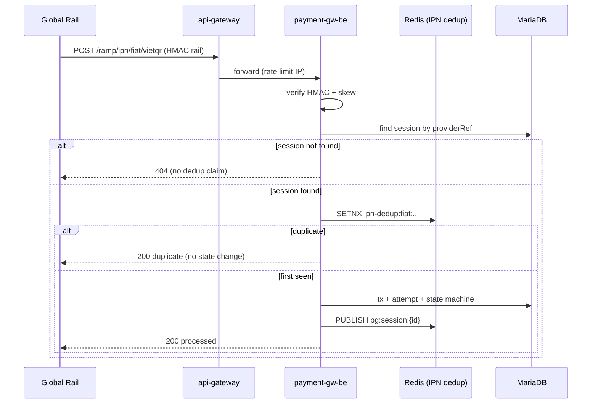
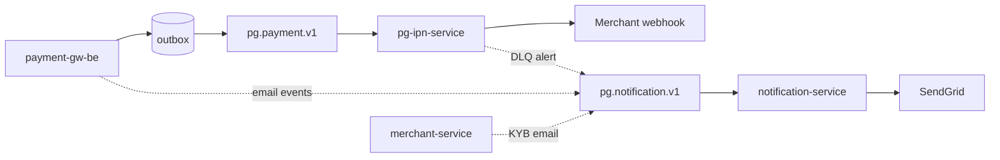

# Phân tích kỹ thuật: Độ tin cậy, Dedup, Idempotency và Thách thức Scale

Tài liệu này bám sát [kiến trúc tổng quan](architecture/README.md) (sơ đồ dòng 13–40) và **mã nguồn thực tế** trong `backend/`. Mục tiêu: giải thích *cách hệ thống đã xử lý* các bài toán HA/reliability — không chỉ liệt kê tính năng trên slide.

---

## Mục lục

1. [Luồng dedup transaction — ba tầng khác nhau](#1-luồng-dedup-transaction--ba-tầng-khác-nhau)
2. [Idempotency — request nào, lớp nào, độ “khó” HA](#2-idempotency--request-nào-lớp-nào-độ-khó-ha)
3. [File management — file nặng và cao tải](#3-file-management--file-nặng-và-cao-tải)
4. [IAM Keycloak — các chế độ hoạt động](#4-iam-keycloak--các-chế-độ-hoạt-động)
5. [Checkout / payment link — session, reliability, deeplink SoF](#5-checkout--payment-link--session-reliability-deeplink-sof)
6. [pg-ipn-service vs notification-service](#6-pg-ipn-service-vs-notification-service)
7. [Bài toán kỹ thuật khó khi scale payment gateway](#7-bài-toán-kỹ-thuật-khó-khi-scale-payment-gateway)

---

## 1. Luồng dedup transaction — ba tầng khác nhau

“Dedup” trong codebase **không phải một cơ chế duy nhất**. Có **ba lớp** với khóa, TTL và hành vi khác nhau:

| Tầng | Vị trí | Khóa dedup | TTL | Mục đích |
|------|--------|------------|-----|----------|
| **A. Inbound IPN (Global Rail → PG)** | `payment-gw-be` | `ipn-dedup:fiat:{providerRef}:{rawStatus}` hoặc `ipn-dedup:crypto:{providerRef}:{rawState}:{txHash}` | Redis 24h (`pg.payment.ipn.dedup-ttl-hours`) | Tránh xử lý lại cùng một thông báo rail |
| **B. Outbound webhook (PG → Merchant)** | `pg-ipn-service` | Redis: `webhook-consumer-dedup:{eventId}` + DB `UNIQUE(event_id)` | Redis 24h | Tránh tạo/gửi webhook trùng khi Kafka redeliver |
| **C. Merchant B2B API** | `api-gateway` | `idempotency:{tenantId}:{routeHash}:{idempotencyKey}` | Redis 72h | Tránh tạo side-effect trùng khi merchant retry HTTP |

Ba tầng này **bổ sung**, không thay thế nhau: IPN rail có thể tới trước khi session tồn tại; merchant retry có thể xảy ra sau khi gateway cache hết hạn.

### 1.1 Tầng A — Dedup IPN inbound (`payment-gw-be`)

**Implement:** `IpnDedupPort` → `RedisIpnDedup` (`SET key 1 NX EX ttl`) hoặc `InMemoryIpnDedup` khi không có Redis.

**Fiat VietQR** (`ReceiveIpnUseCase`):

1. Verify timestamp skew + HMAC (`RailSigningPort`).
2. **Resolve session** theo `providerRef` — nếu chưa có → **404**, **chưa claim dedup** (cho phép Global Rail replay sau khi session được tạo).
3. Validate `rawStatus` map được sang canonical — nếu lỗi → 400, **chưa claim dedup** (tránh “đóng băng” lỗi validation).
4. **Mới claim dedup:** `ipn-dedup:fiat:{providerRef}:{rawStatus}`.
5. Trong một `@Transactional`: cập nhật `ProviderTransaction`, insert `PaymentAttempt`, state machine transition, **post-commit** publish Redis Pub/Sub cho checkout SSE.

**Crypto** (`ReceiveCryptoIpnUseCase`): tương tự nhưng khóa gồm thêm `txHash` và `rawState` — vì cùng tx on-chain có thể qua nhiều trạng thái (DETECTED → CONFIRMED); dedup theo từng cặp `(providerRef, rawState, txHash)` nhưng **tích lũy amount** theo txHash để không cộng đôi.

**Chứng minh trong test (unit):**

- `ReceiveIpnUseCaseTest.unknownProviderRef_throwsPGBE0401_dedupNotClaimed` — session missing → `ipnDedup.tryClaim` **never**.
- `ReceiveIpnUseCaseTest.validSession_thenDuplicate_returnsDeduplicated` — lần 2 `tryClaim` false → `IpnResult.duplicated()`, không đổi state.
- `ReceiveCryptoIpnUseCaseTest.duplicate_returnsDeduplicated_noStateChange` — tương tự crypto.
- `InMemoryIpnDedupTest` / pattern giống `RedisDedupStoreTest` ở pg-ipn — atomic SETNX semantics.



**Điểm thiết kế quan trọng:** Dedup IPN **cố ý không** dùng `Idempotency-Key` của api-gateway (route `/ramp/ipn/**` không gắn filter Idempotency). Lý do: contract ký HMAC của rail khác merchant B2B; dedup semantic gắn `providerRef` + trạng thái rail.

### 1.2 Tầng B — Dedup sự kiện → webhook job (`pg-ipn-service`)

Luồng **không** bắt đầu từ HTTP merchant mà từ **Kafka**:

```
payment-gw-be (state change)
  → outbox table (cùng TX DB)
  → OutboxRelayScheduler (500ms, ShedLock)
  → Kafka pg.payment.v1 / pg.refund.v1
  → pg-ipn-service PaymentSessionEventConsumer
  → CreateWebhookJobUseCase
```

`CreateWebhookJobUseCase` — **two-tier dedup:**

1. **Redis** `webhook-consumer-dedup:{eventId}` — 24h, cheap fast path.
2. **DB** `UNIQUE(event_id)` trên `webhook_jobs` — durable khi Redis miss/TTL hết/redelivery > 24h.

Nếu DB unique violation → log `webhook_dedup_db_skip`, **không** gửi lại HTTP cho merchant.

Dispatch thực tế: scheduler `PENDING` (5s) / `RETRYING` (15s), `WebhookDispatcher` + HMAC ký qua `merchant-service /webhook/sign`, exponential backoff tới 48h, DLQ → có thể publish `notification.requested` (ops alert email).

### 1.3 Tầng C — Dedup HTTP merchant (`api-gateway`)

`IdempotencyGatewayFilterFactory` trên `/api/v1/**` (sau `HmacSigV4`):

- Chỉ **POST/PUT/PATCH**.
- Key: `idempotency:{tenantId}:{sha256(method:path)}:{Idempotency-Key}`.
- `SETNX` record `PROCESSING` → downstream → capture response → `COMPLETED` (cache body tới 1MB, TTL 72h).
- Trùng key + khác body hash → **400** `PGBE-0204`.
- Trùng key đang `PROCESSING` → **409** + `Retry-After`.
- Trùng key `COMPLETED` → replay response + header `X-Idempotent-Replayed: true`.
- Downstream **5xx** → **xóa** key để client retry được.
- Redis down → **503** (không giả 409 “đang xử lý”).

**Backup DB** tại `payment-gw-be`: `UNIQUE (merchant_id, idempotency_key)` trên `payment_sessions`; refund `uk_refund_idempotency`. Nếu gateway cache miss và insert trùng → `PaymentExceptionHandler` → **409 Conflict**.

---

## 2. Idempotency — request nào, lớp nào, độ “khó” HA

### 2.1 Ma trận theo route / use case

| Request / luồng | Idempotency HTTP (gateway) | Idempotency DB / app | Dedup riêng | Độ phức tạp HA |
|-----------------|---------------------------|----------------------|-------------|----------------|
| `POST /api/v1/payment-sessions` | ✅ Bắt buộc `Idempotency-Key` | ✅ `uk_idem` | — | **Cao** — gọi Global Rail, outbox, session TTL |
| `POST /api/v1/.../refunds` (merchant) | ✅ | ✅ `uk_refund_idempotency` + lookup trước insert | — | **Cao** — race 2 tab, rail refund |
| `POST /api/v1/checkout/sessions/*/finalize-method` | ❌ (public checkout) | State guard `PENDING/METHOD_PENDING` | — | **Trung bình** — 409 nếu đã finalize |
| `GET /api/v1/checkout/**` | — | — | — | Thấp (read-only) |
| `POST /ramp/ipn/fiat/**`, `/ramp/ipn/crypto` | ❌ | — | ✅ Redis IPN dedup | **Rất cao** — at-least-once từ rail |
| Kafka → pg-ipn | — | ✅ `event_id` unique | ✅ Redis 24h | **Cao** — consumer lag, DLQ |
| Global Rail outbound (`/execute/*`) | Key gửi sang rail | Circuit breaker + retry | Rail-side (giả định) | **Cao** |
| File `upload-init` / `complete` | JWT/HMAC tùy route | Optimistic lock `@Version` | — | Trung bình |
| KYB / merchant lifecycle | Một số use case “idempotent no-op” | State machine | — | Trung bình |

### 2.2 Request cần nhiều kỹ thuật nhất

Thứ tự “stack” kỹ thuật dày nhất trong repo hiện tại:

1. **Inbound IPN (fiat + crypto)**  
   HMAC verify, skew, dedup có thứ tự (session trước / dedup sau), transactional state machine, cumulative amount crypto, surplus refund idempotent (`UNIQUE session_id`), post-commit Redis Pub/Sub, outbox → Kafka → merchant webhook (tầng khác).

2. **Tạo payment session (B2B)**  
   Gateway idempotency 72h + DB unique + gọi Global Rail (Resilience4j circuit `global-rail`, mTLS, HMAC outbound) + FX lock (crypto) + outbox event trong cùng transaction.

3. **Merchant refund**  
   Gateway + `findByMerchantIdAndIdempotencyKey` + `REQUIRES_NEW` inner tx + catch `DataIntegrityViolationException` race + rail refund idempotency key.

4. **Outbound merchant webhook (pg-ipn)**  
   Kafka at-least-once, two-tier dedup, job state machine `PENDING→IN_FLIGHT→DELIVERED|RETRYING|DLQ`, ShedLock multi-pod, `Retry-After` RFC 7231, private URL guard, sign-service outage defer 60s.

5. **Finalize checkout method**  
   Không có `Idempotency-Key` công khai; dựa session state + provider_tx duplicate swallow — phù hợp payer browser retry nhưng ít lớp hơn B2B.

### 2.3 Transactional Outbox (cầu nối ghi nhận ↔ phản hồi async)

`payment-gw-be` ghi `outbox` **trong cùng transaction** với cập nhật session/refund. `OutboxRelayScheduler` poll 500ms, ShedLock, publish từng event `REQUIRES_NEW` — đảm bảo merchant nhận webhook **sau khi** DB đã commit, không phụ thuộc “fire-and-forget Kafka” trong request thread.

Đây là mấu chốt **“ghi nhận transaction chính xác rồi mới báo ra ngoài”** — tách với idempotency HTTP của merchant.

---

## 3. File management — file nặng và cao tải

Service: `file-management-service` (MinIO S3-compatible).

### 3.1 Mô hình offload tải (tránh proxy file qua API)

**Ba bước:**

1. `upload-init` — validate `sizeBytes` ≤ `pg.files.max-size-bytes` (mặc định **100 MB**), tạo metadata `UPLOADING`, trả **presigned PUT URL** (TTL 15 phút).
2. Client **PUT trực tiếp MinIO** — bytes không đi qua gateway/service JVM.
3. `complete` hoặc webhook MinIO → `CompletionHandlerUseCase`.

→ API tier chỉ xử lý metadata + signing URL; phù hợp file nặng KYB/export/evidence.

### 3.2 Xử lý đặc thù “nặng” / đúng / concurrent

| Cơ chế | Mô tả |
|--------|--------|
| **Giới hạn kích thước** | `FileSizeExceededException` tại init nếu `sizeBytes` vượt cap |
| **SHA-256 server-side** | Sau upload, **re-download** object từ MinIO, hash 8KB buffer — **không tin** checksum từ event MinIO |
| **Optimistic locking** | `@Version` trên metadata — race webhook vs `/complete` → loser silent return, tránh double publish `pg.file.v1` |
| **Retention batch** | `RetentionScheduler` xóa theo bucket policy, `BATCH_SIZE=1000` mỗi lần — tránh OOM khi bật retention trên bucket lớn |
| **Buckets tách mục đích** | `pg-kyb`, `pg-refund-evidence`, `pg-export`, `pg-branding` |

### 3.3 Điểm chưa / hạn chế khi scale cực đại

- Không thấy multipart upload API hay virus scan pipeline trong code — file rất lớn (>100MB) bị chặn ở init.
- Download qua presigned GET (pattern `DownloadUrlUseCase`) — cần scale MinIO cluster + CDN nếu export/report hot.
- Redis “upload session” (docs kiến trúc) — cache metadata ngắn hạn, không thay thế object store.

---

## 4. IAM Keycloak — các chế độ hoạt động

Realm: **`payment-gateway`** (bundle `payment-gateway-realm.json`).

### 4.1 Realm roles (authorization trong PG)

`SUPER_ADMIN`, `OPERATIONS`, `MERCHANT_ADMIN`, `MERCHANT_READONLY`, `SRE`, `COMPLIANCE`, `MERCHANT_FINANCE`, `MERCHANT_DEVELOPER`, `MERCHANT_SUPPORT` — map 1:1 `PgRole` enum trong `common-auth`.

JWT custom claims qua scope `pg-claims`: **`tenantId`**, **`roles`**, **`mfa`**.

### 4.2 Client / grant type (các “chế độ” đăng nhập)

| Client | Public? | Grant / flow | Ai dùng |
|--------|---------|--------------|---------|
| **merchant-dashboard** | Confidential | OAuth2 **Authorization Code + PKCE S256** | Merchant SPA (`/api/merchant/**` JWT) |
| **admin-portal** | Confidential | OAuth2 **Authorization Code** (+ gateway `adminOAuth2Login`) | Admin portal BFF cookie session |
| **pg-password-validator** | **Public** | **Resource Owner Password Credentials** (direct access) | Login email/password merchant + admin credential login qua gateway |
| **merchant-service** | Confidential | **Client credentials** (service account) | Server gọi Keycloak Admin API (`manage-users`) — provision user KYB/team |

Cấu hình token: access token ~**900s**, refresh **reuse=0** + revoke, brute-force protection, password policy mạnh.

### 4.3 Cách gateway áp dụng

| Kênh | Filter / mechanism |
|------|-------------------|
| B2B `/api/v1/**` (trừ checkout public) | **HMAC SigV4** — không JWT; inject `X-Tenant-Id` từ API key |
| Merchant dashboard `/api/v1/merchants/**`, `/api/merchant/**` | **JwtValidation** + **TenantHeaderInjection** |
| Admin `/api/admin/**` | **CookieJwtBridge** → **JwtValidation** → tenant header |
| Hosted checkout `/api/v1/checkout/**` | **Không auth** — `sessionId` trong URL là capability token; rate limit theo IP trên finalize |

**Tenant isolation:** `tenantId` claim + header injection — service downstream tin gateway đã validate (NetworkPolicy prod: chỉ gateway vào `payment-gw-be:18150`).

---

## 5. Checkout / payment link — session, reliability, deeplink SoF

### 5.1 Mô hình session

- Merchant tạo link: `POST /api/v1/payment-sessions` → `checkoutUrl = {base}/c/{sessionId}`, TTL mặc định **15 phút** (`pg.payment.checkout.session-ttl-minutes`).
- Hai mode:
  - **Có `method` ngay:** provision VietQR/crypto ngay, sub-state `WAITING_SCAN` / deposit address.
  - **Deferred method:** `PENDING` + `METHOD_PENDING` — khách chọn rail trên UI → `POST .../finalize-method` (giữ **cùng sessionId** trong URL).

Idempotency tạo session: gateway 72h + DB `uk_idem`. Finalize: **không** Idempotency-Key; guard state → duplicate POST → **409** + portal refetch.

### 5.2 Reliability phía payer (realtime)

Sau IPN/state change, `RedisSessionEventPublisher` publish channel `pg:session:{sessionId}` → `CheckoutSseController` / `CheckoutSseRegistry` broadcast tới browser — payer thấy trạng thái mà không poll liên tục.

**Hạn chế scale SSE:** registry in-memory trên từng pod `payment-gw-be` — cần sticky session hoặc chuyển sang Redis-backed SSE fanout khi nhiều replica (hiện Pub/Sub Redis đã có cho publish, consumer SSE gắn pod).

Public read: `GetPublicCheckoutSessionUseCase` — không lộ field nội bộ merchant; QR từ `ProviderTransaction.rawMetadata`.

### 5.3 Deeplink tới Source of Fund (SoF)

**Trong code hiện tại: không có deeplink/mobile app scheme** tới ví ngân hàng, MoMo, USDT wallet, v.v.

Thực tế checkout:

- **Fiat:** trả `qrPayload` / `qrImageUrl` — khách quét VietQR (ngân hàng app đọc QR).
- **Crypto:** `depositAddress`, `memo`, `chain`, `amountExact`, FX lock 15p — khách copy/paste hoặc wallet quét địa chỉ (không universal deeplink).

### 5.4 Mô hình nếu muốn deeplink SoF (đề xuất kiến trúc)

```text
Checkout UI
  ├─ rail = FIAT_VIETQR  → deep link bank app (nếu bank hỗ trợ intent URL trong QR payload)
  ├─ rail = FIAT_*       → mở app ví theo scheme merchant/policy cấu hình
  └─ rail = CRYPTO       → trust:// / metamask:// / ton:// theo chain (policy per chain)

payment-gw-be
  └─ trả thêm paymentInstruments[]: { type, deepLink, fallbackWebUrl }
       lấy từ Global Rail hoặc policy-service (không hardcode trong session row)
```

Ràng buộc: deeplink phụ thuộc **OS + app cài đặt**; gateway vẫn chỉ tin **IPN rail** là nguồn sự thật thanh toán, không tin “user đã bấm mở app”.

---

## 6. pg-ipn-service vs notification-service

Hai tên dễ nhầm vì đều có chữ “notification/event”, nhưng **vai trò khác hẳn**:

| | **pg-ipn-service** | **notification-service** |
|--|-------------------|-------------------------|
| **Đối tượng** | **Merchant server** (B2B webhook URL đăng ký) | **Người dùng nội bộ / email recipient** (SendGrid) |
| **Kênh** | HTTP POST signed HMAC tới URL merchant | Email (template DB) |
| **Input** | Kafka `pg.payment.v1`, `pg.refund.v1` | Kafka `pg.notification.v1` |
| **Output** | Webhook JSON + retry/DLQ | SendGrid API |
| **Idempotency** | eventId dedup + job row | Template + recipient prefs (opt-out) |
| **Failure semantics** | 48h retry, DLQ, ops alert qua Kafka | DLQ `pg.notification.dlq` |

**Tại sao tách service IPN (webhook)?**

1. **Tách failure domain:** Merchant endpoint chậm/500/timeout không được block thread xử lý payment core.
2. **Scale độc lập:** Tăng consumer/dispatcher pod khi merchant count lớn; payment-gw-be giữ CPU cho state machine + rail.
3. **Chính sách retry khác email:** `Retry-After`, exponential backoff, circuit URL merchant — khác hoàn toàn SendGrid rate limit.
4. **Bảo mật:** Ký webhook secret qua `merchant-service` internal; không lộ secret vào payment-gw-be.

**Luồng event khi scale — cần chú ý:**



- **Ordering:** Kafka partition key (thường `sessionId` / aggregate id) — merchant nhận event cùng aggregate theo thứ tự partition nếu key ổn định.
- **Lag:** IPN consumer lag → merchant thấy trễ webhook; cần monitor consumer group `pg-ipn-service-v1`, DLQ depth.
- **Duplicate:** Đã có Redis + DB unique — merchant **phải** dedup theo `eventId` (contract canonical event).
- **Poison pill:** `EnvelopeProcessor` swallow JSON parse error (advance offset) — cần alert metric `webhook_kafka_parse_failed_total`.

`pg-ipn-service` **không** thay thế notification: chỉ publish sang `pg.notification.v1` khi webhook vào **DLQ** (ops), không gửi email cho mọi payment success.

---

## 7. Bài toán kỹ thuật khó khi scale payment gateway

Dưới đây là checklist **bản chất** — những gì repo đã có giải pháp một phần và gì vẫn là thách thức khi tải lớn.

### 7.1 Đúng một lần trong distributed system

- **At-least-once everywhere:** HTTP merchant retry, Kafka redelivery, Global Rail IPN replay → bắt buộc idempotency/dedup đa tầng (đã làm).
- **Gap TTL:** IPN dedup 24h, gateway idempotency 72h — event redeliver sau TTL có thể xử lý lại (cần merchant + DB idempotent semantics hoặc tăng TTL có chủ đích).
- **Exactly-once illusion:** Không có EOS Kafka→DB trong pg-ipn; dựa **unique keys** — đúng hướng production.

### 7.2 Ghi nhận tiền vs phản hồi merchant

- **Source of truth:** MariaDB session + `PaymentAttempt` audit trail, không phải webhook đã gửi.
- **Outbox** tránh “đã báo merchant nhưng DB rollback”.
- **Canonical state** che raw rail — scale team merchant không parse 20 status bank.

### 7.3 Hot path và coupling Global Rail

- Mọi create/finalize gọi rail — circuit breaker 60s open, mock/real switch.
- IPN flood → `payment-gw-be` CPU + Redis + DB row lock trên session — scale horizontal BE + connection pool + partition IPN rate limit.
- **Không** scale bằng cách nhân đôi xử lý cùng IPN (dedup bảo vệ).

### 7.4 Checkout realtime @ scale

- Redis Pub/Sub + SSE per pod — multi-region cần thống nhất fanout.
- Session TTL 15p + expiry job — clock skew, expire race với IPN đến muộn.

### 7.5 Webhook merchant @ scale

- Hàng nghìn merchant × nhiều event/s — pg-ipn scheduler batch, ShedLock, optimistic `markInFlight`.
- Merchant chậm → queue RETRYING dài — cần shard job table hoặc tăng worker, watch DB index `(state, next_attempt_at)`.

### 7.6 Data plane vs control plane

- **policy-service**, **fx-pricing-service** — read on hot path (cache?).
- **report-service** — read replica / Aerospike (PRD) tách analytics khỏi OLTP.

### 7.7 Compliance & security @ scale

- HMAC + replay nonce + mTLS rail — key rotation (`MerchantSecretRotatedListener` ở pg-ipn).
- PII trong file KYB — MinIO encryption at rest, retention, access log.
- Keycloak session/token — brute force, tenant claim đúng.

### 7.8 Observability là điều kiện scale

- Metrics đã có: `pg.idempotency.*`, `webhook_job_created_total`, circuit open, parse failed.
- Cần SLO: IPN processing latency p99, outbox lag, webhook DLQ rate, consumer lag.

### 7.9 Những gì “chưa thấy” trong code (gap khi tải rất lớn)

- IP allowlist + mTLS termination tại gateway cho `/ramp/ipn/**` (ghi chú deferred ops).
- Deeplink SoF / mobile wallet orchestration.
- Cross-region active-active (Kafka, Redis, DB conflict).
- Automated reconciliation batch vs rail ledger (có settlement IPN nhưng scale cần pipeline riêng).

---

## Tóm tắt một câu

Hệ thống coi **dedup và idempotency là hợp đồng đa tầng**: merchant HTTP (gateway + DB), rail IPN (Redis semantic key), merchant webhook (Redis + `event_id` unique), còn **ghi nhận tiền** nằm ở transaction DB + outbox; **pg-ipn-service** chỉ là “đẩy tin đã commit ra merchant” với retry/DLQ, **không** phải kênh email hay thay core payment.

---

## Tham chiếu mã nguồn nhanh

| Chủ đề | File chính |
|--------|------------|
| IPN fiat dedup | `payment-gw-be/.../ReceiveIpnUseCase.java` |
| IPN crypto dedup | `payment-gw-be/.../ReceiveCryptoIpnUseCase.java` |
| Redis IPN dedup | `payment-gw-be/.../RedisIpnDedup.java` |
| Gateway idempotency | `api-gateway/.../IdempotencyGatewayFilterFactory.java` |
| Webhook dedup | `pg-ipn-service/.../CreateWebhookJobUseCase.java` |
| Outbox | `payment-gw-be/.../OutboxRelayScheduler.java` |
| Checkout session | `payment-gw-be/.../CreatePaymentSessionUseCase.java`, `FinalizeMethodUseCase.java` |
| SSE | `payment-gw-be/.../CheckoutSseRegistry.java`, `RedisSessionEventPublisher.java` |
| File upload | `file-management-service/.../UploadInitUseCase.java`, `CompletionHandlerUseCase.java` |
| Keycloak realm | `merchant-service/src/test/resources/keycloak/payment-gateway-realm.json` |

Tài liệu kiến trúc gốc: [architecture/README.md](architecture/README.md), [services.md](architecture/services.md), [merchant-integration.md](architecture/merchant-integration.md), [global-rail-integration.md](architecture/global-rail-integration.md).
