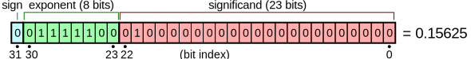

# IEEE 754 Floats

Cấu trúc số thực trong IEEE 754, Một số thực được lưu bằng ba phần:
* Sign (1 bit): cho biết số dương (0) hay âm (1).
* Exponent (mũ): lưu phần mũ, có thêm “bias” để biểu diễn số nhỏ hơn 1.
* Mantissa (hay fraction): lưu phần trị số chính xác.

Các dạng phổ biến:

| Loại (Type) | Bit dấu (Sign) | Bit mũ (Exponent) | Bit trị số (Mantissa) | Tổng số bit (Total bits) | Số chữ số thập phân xấp xỉ |
| ----------- | -------------- | ----------------- | --------------------- | ------------------------ | -------------------------- |
| single      | 1              | 8                 | 23                    | 32                       | ~7.2                       |
| double      | 1              | 11                | 52                    | 64                       | ~15.9                      |
| half        | 1              | 5                 | 10                    | 16                       | ~3.3                       |
| extended    | 1              | 15                | 64                    | 80                       | ~19.2                      |
| quadruple   | 1              | 15                | 112                   | 128                      | ~34.0                      |
| bfloat16    | 1              | 8                 | 7                     | 16                       | ~2.3                       |

### Các mức hỗ trợ phần cứng

* Single và Double precision: Hầu hết CPU đều hỗ trợ hai loại này. Trong ngôn ngữ C, chúng tương ứng với kiểu float và double.

* Extended formats: Chỉ có trên kiến trúc x86, trong C gọi là long double. Trên CPU Arm thì long double thực chất chỉ là double.
Việc chọn 64 bit mantissa giúp biểu diễn chính xác mọi số nguyên kiểu long long. Ngoài ra còn có định dạng 40-bit với 32 bit mantissa.

* Half precision (16-bit): Hỗ trợ rất ít phép toán, thường dùng trong machine learning, đặc biệt là mạng nơ-ron, vì cần tính toán khối lượng lớn nhưng không đòi hỏi độ chính xác cao.

* Bfloat16: Dần thay thế half. Nó hy sinh 3 bit mantissa để có cùng phạm vi với single precision, giúp dễ tương thích. Chủ yếu được dùng trên phần cứng chuyên dụng: TPU, FPGA, GPU. Tên gọi “Brain float” xuất phát từ ứng dụng trong AI.

Sự bùng nổ của deep learning (tính toán ma trận khổng lồ) tạo ra nhu cầu lớn về nhân ma trận với độ chính xác thấp.

* Google phát triển TPU chuyên nhân ma trận bfloat16 kích thước 128×128.
* NVIDIA thêm tensor cores vào GPU mới, có thể nhân ma trận 4×4 chỉ trong một bước.

### Handling Corner Cases
Trong số nguyên, chia cho 0 thường gây crash. Nhưng với số thực IEEE 754, có cách xử lý khác.

👉 Ví dụ thực tế: Năm 1996, chuyến bay đầu tiên của tên lửa Ariane 5 kết thúc bằng vụ nổ thảm khốc. Nguyên nhân: lỗi chuyển đổi số thực sang số nguyên (overflow). Hệ thống điều hướng nghĩ rằng tên lửa lệch hướng và tự điều chỉnh mạnh, dẫn đến vỡ vụn một tên lửa trị giá 200 triệu USD.

Cách CPU xử lý ngoại lệ khi xảy ra lỗi số học:

* CPU ngắt chương trình.
* Đóng gói thông tin vào cấu trúc gọi là interrupt vector.
* Chuyển cho OS, OS gọi đoạn mã xử lý (nếu có) hoặc kết thúc chương trình.

Cơ chế này phức tạp và khá chậm, không phù hợp cho hệ thống thời gian thực (ví dụ: điều khiển tên lửa).

...
